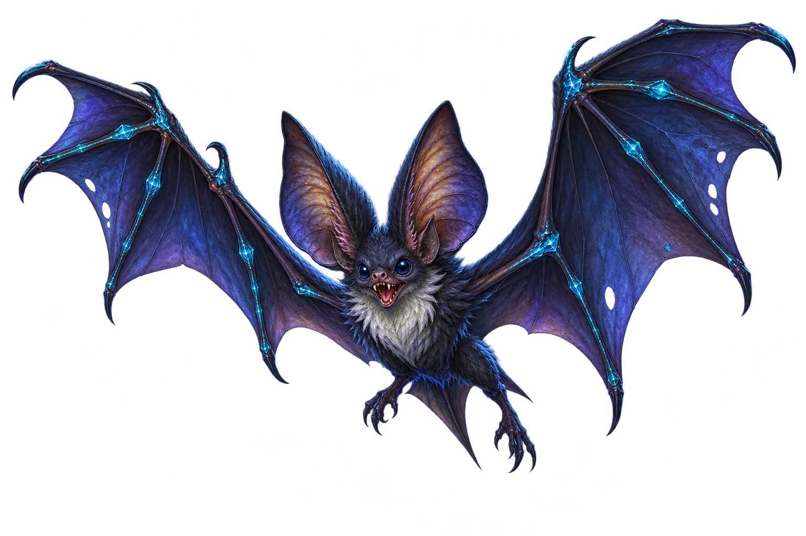
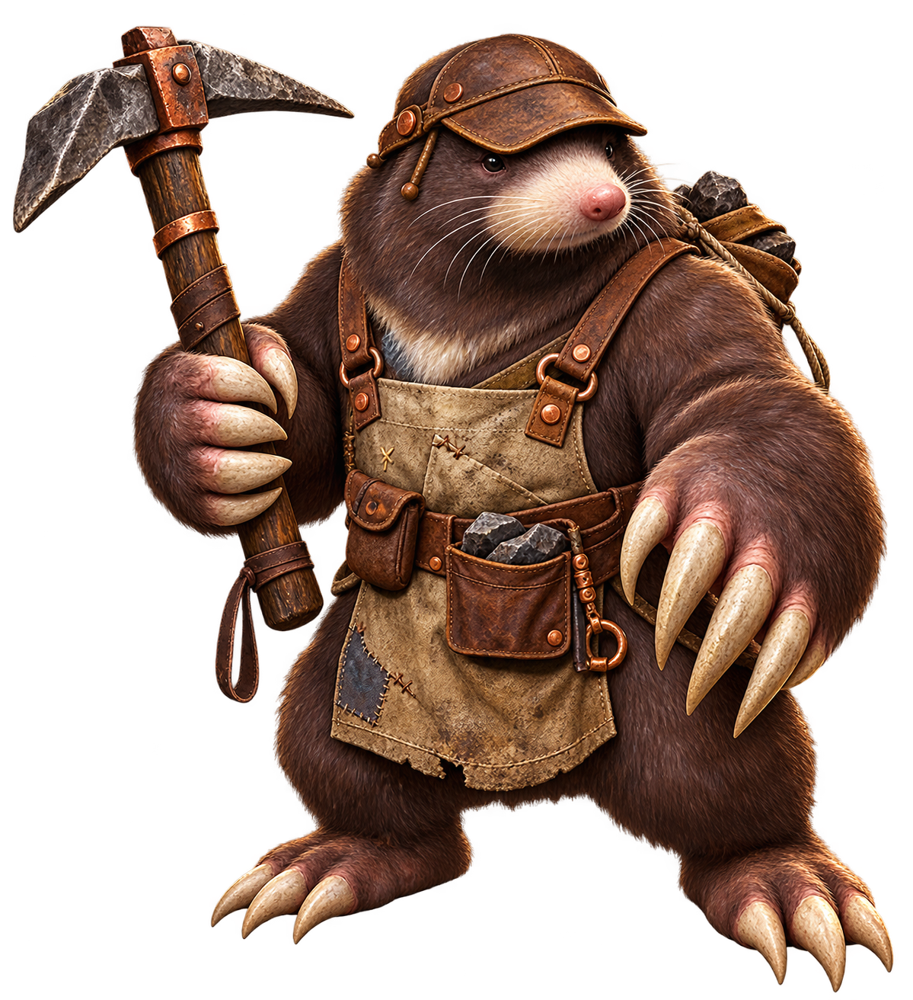
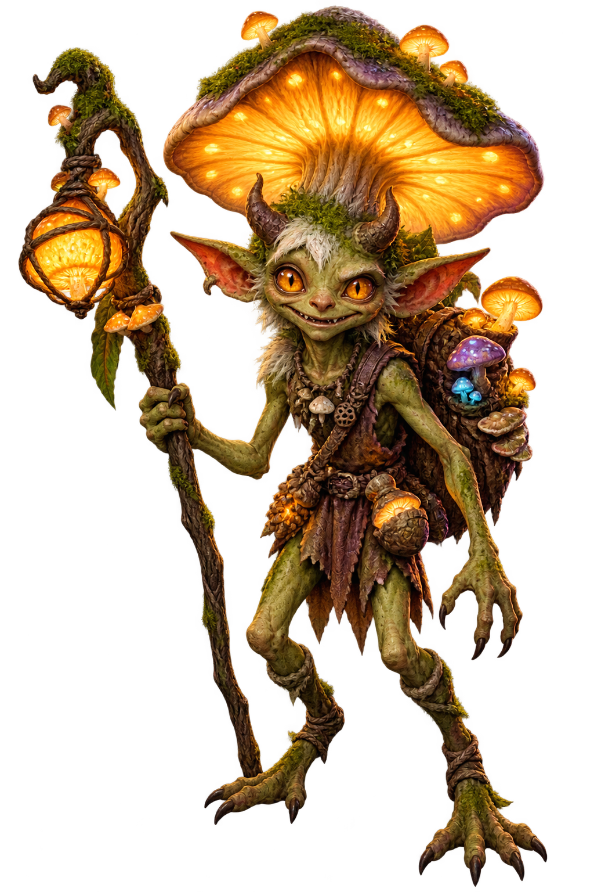
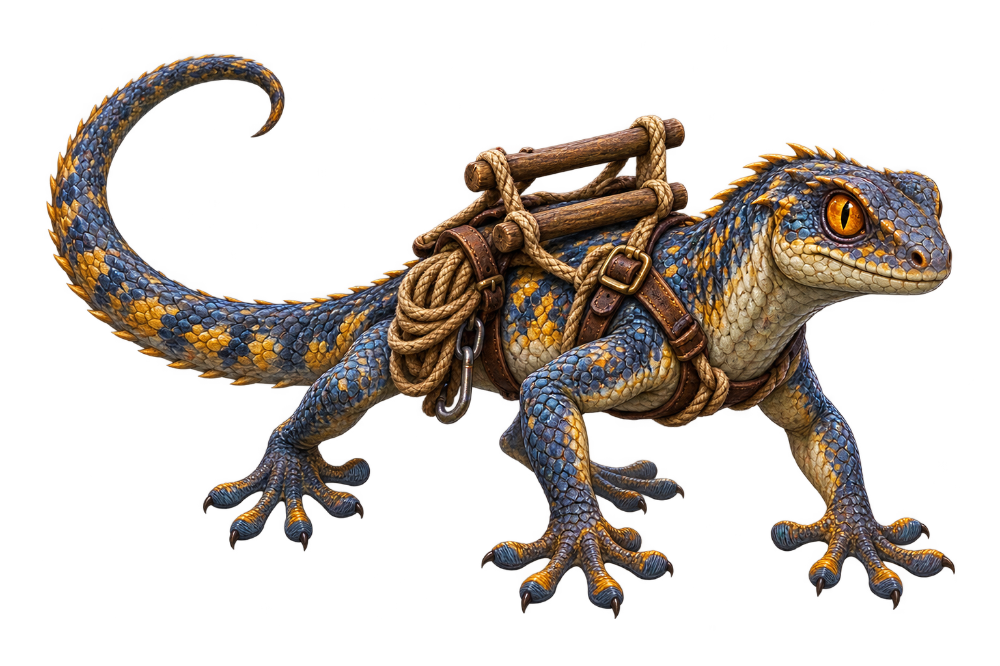
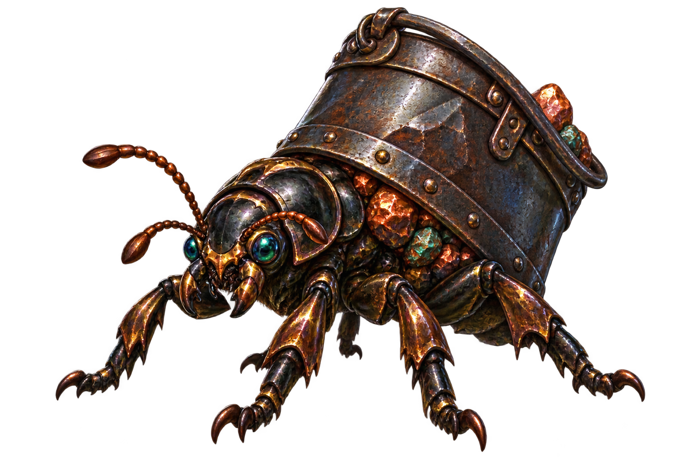
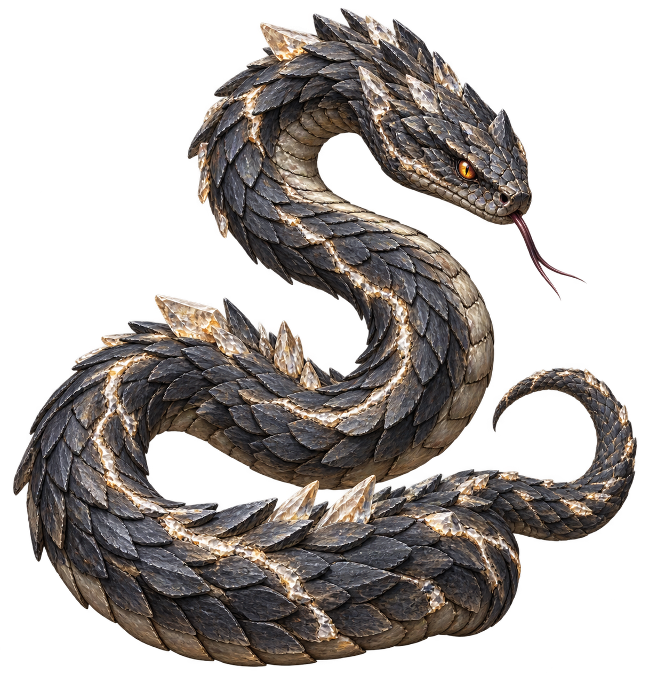
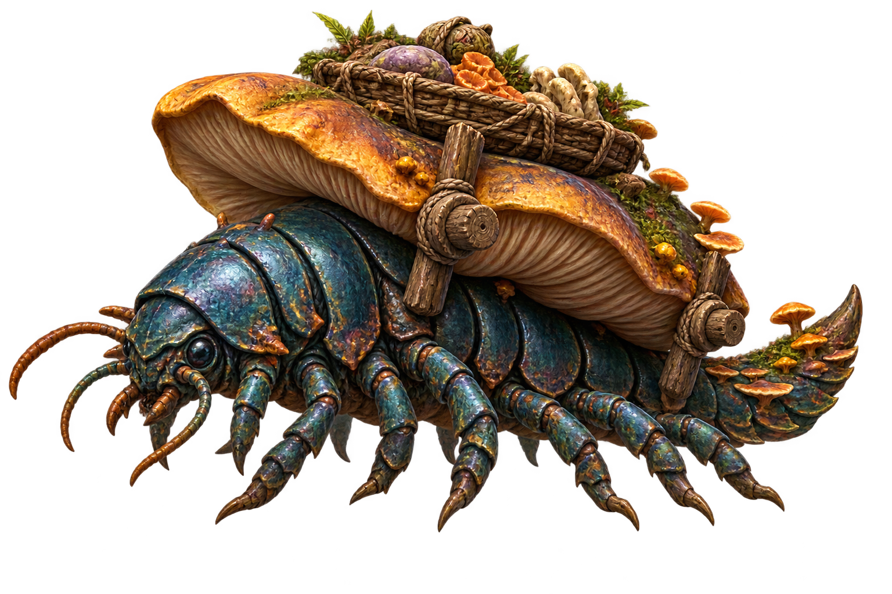
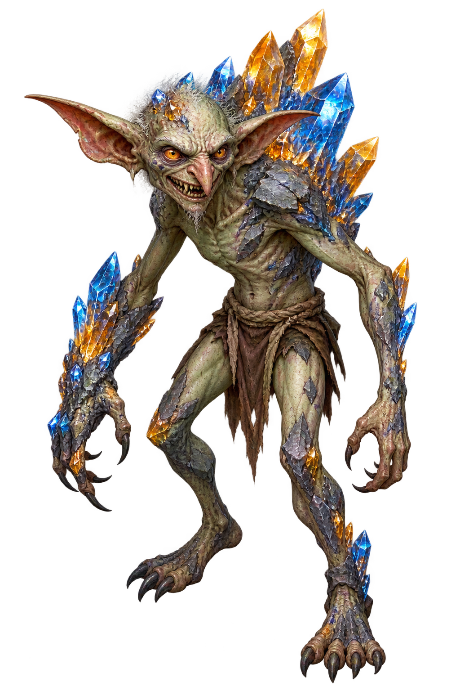
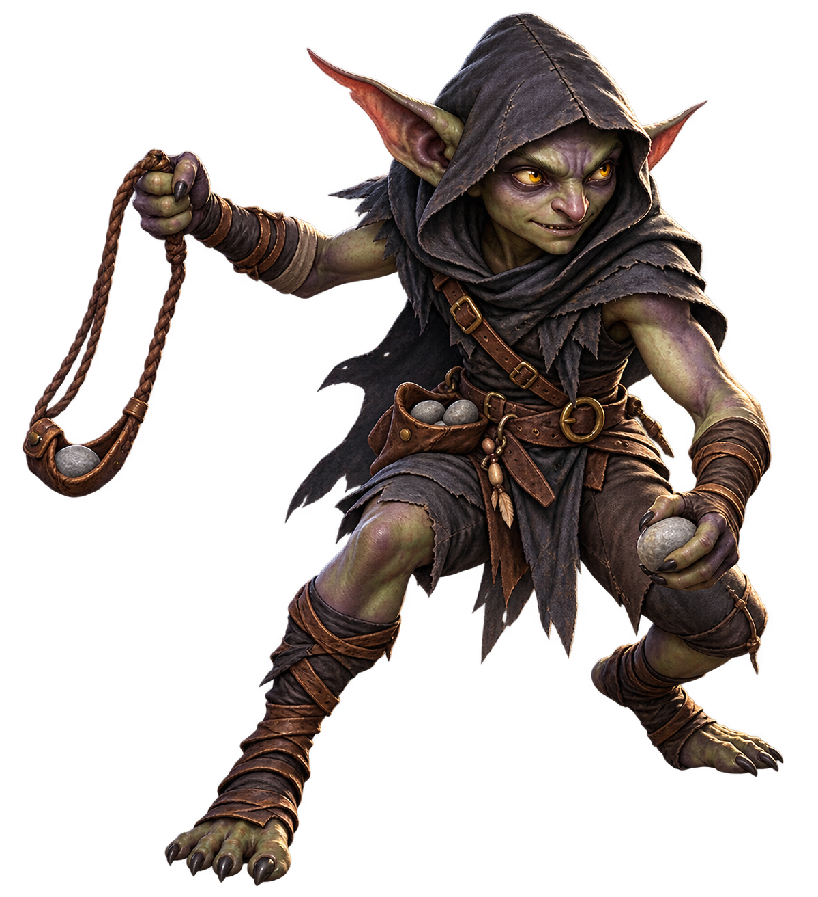
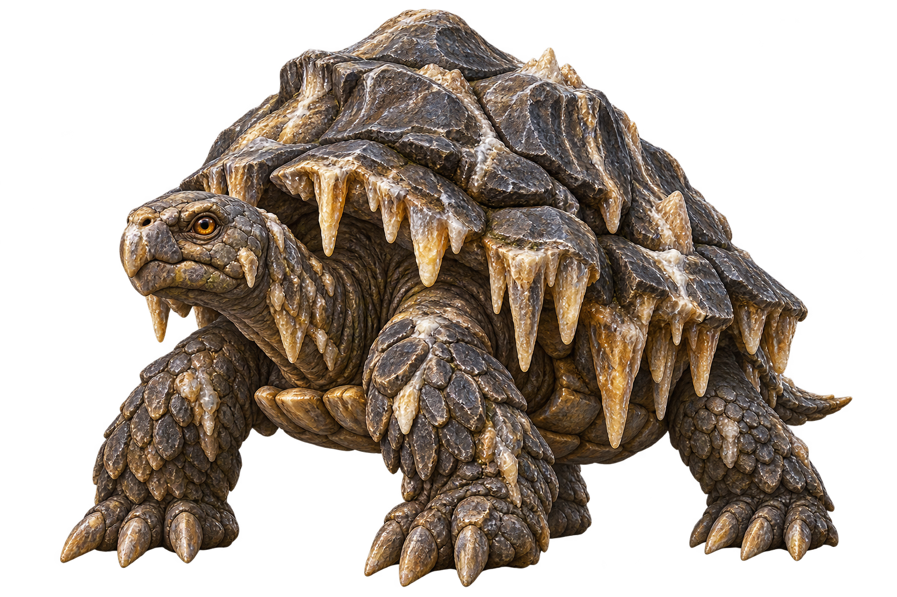

# ART003 B03 Owner Visual Review Pack

Task: `ART003_B03_M024_M033_CANONICAL_MONSTER_ART_PRODUCTION_001`

This pack contains exactly the ten F036-planned B03 production candidates. The images below reference the selected canonical-path PNG bytes directly; no resize, crop, re-encode, color adjustment, retouch, or regeneration was performed after selection and technical QA.

Owner review outcome for every row is **PASS** (**10/10**). The Owner decision for each row is recorded as exactly `PASS`; no row is `REVISE` or `REJECT`. The selected image bytes were verified against the immutable Owner-approved hashes before publication, and no image bytes were changed after selection. This Owner decision authorizes canonical art freeze/publication only; it does not grant runtime or gameplay authority.

| M-ID | Canonical name | F035 Zone | Identity summary | Technical QA | Style continuity | Owner review |
|---|---|---:|---|---|---|---|
| M024 | Echo Bat | Z3 | Charcoal-indigo cave bat with enormous echo-sensitive ears, broad crystalline resonance-marked wings, and a pale throat ruff. | PASS | PASS | PASS |
| M025 | Pickaxe Moleworker | Z3 | Stocky umber mole with oversized digging claws, patched miner apron, leather cap, and an unmistakable stone-headed pickaxe. | PASS | PASS | PASS |
| M026 | Fungus Lantern Imp | Z3 | Lanky mossy imp with pointed ears and short horns, dominated by a warm amber mushroom lantern cap and a fungus-covered satchel. | PASS | PASS | PASS |
| M027 | Rope-Ladder Lizard | Z3 | Slate-blue and ochre cave lizard with a long tail, splayed gecko feet, and a compact wooden-rung rope ladder rig across its back. | PASS | PASS | PASS |
| M028 | Ironbucket Beetle | Z3 | Squat six-legged beetle with glossy bronze-black armor, jewel eyes, ore fragments, and a raised dented iron bucket forming its shell. | PASS | PASS | PASS |
| M029 | Crevice Snake | Z3 | Long shale-plated cave snake in a clear S-curve, with a wedge viper head, mineral seams, and small pale crystal plates along its spine. | PASS | PASS | PASS |
| M030 | Cartcap Crawler | Z3 | Low pillbug-centipede crawler with many legs, iridescent armor, and a broad wagon-like mushroom cap carrying a woven fungus tray. | PASS | PASS | PASS |
| M031 | Crystal Ore Gob | Z3 | Wiry ash-green goblin with an angular brittle frame and asymmetrical blue-and-amber crystal ore growths. | PASS | PASS | PASS |
| M032 | Cavern Slinger | Z3 | Lean dusky goblin scout in a charcoal hood and leather harness, posed low with a braided sling and a pouch of smooth stones. | PASS | PASS | PASS |
| M033 | Stalactite Tortoise | Z3 | Heavy limestone tortoise with layered stone shell plates, hanging stalactites, mineral veins, thick clawed feet, and an amber eye. | PASS | PASS | PASS |

## Images

### M024 — Echo Bat

### M025 — Pickaxe Moleworker

### M026 — Fungus Lantern Imp

### M027 — Rope-Ladder Lizard

### M028 — Ironbucket Beetle

### M029 — Crevice Snake

### M030 — Cartcap Crawler

### M031 — Crystal Ore Gob

### M032 — Cavern Slinger

### M033 — Stalactite Tortoise

## Authority boundary

- F035 Zone `Z3` is art-content planning metadata only.
- No B03 candidate is runtime-mapped or gameplay-authoritative.
- M022 remains the existing runtime identity and was not regenerated.
- B01 and B02 canonical art lineages are protected and untouched.
- B03-R1 freeze/publication is recorded as `OWNER_PASS_FROZEN_AND_PUBLISHED` after all ten Owner decisions were recorded as `PASS`.
