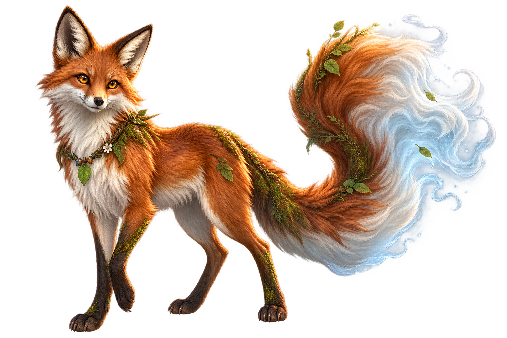
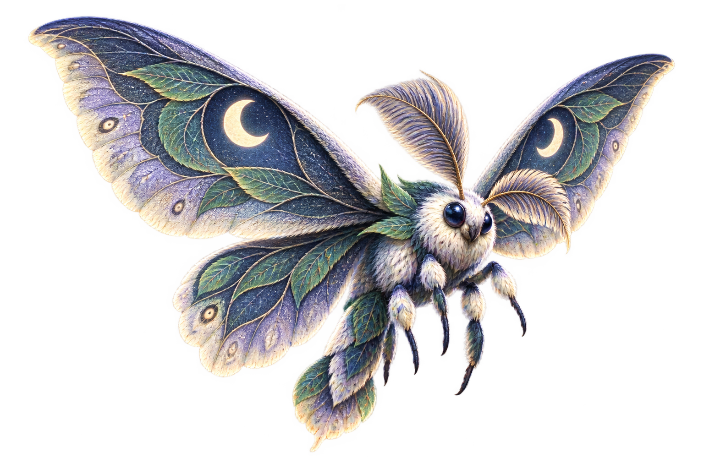
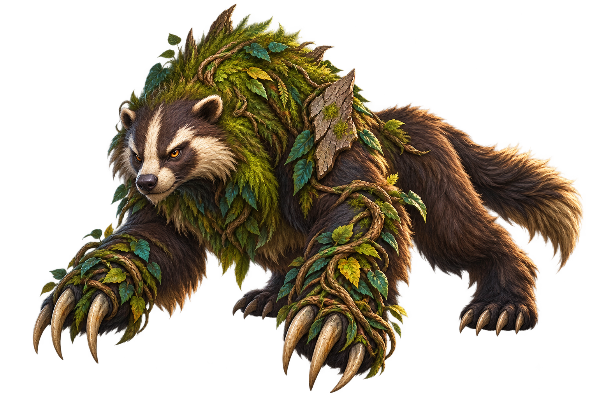
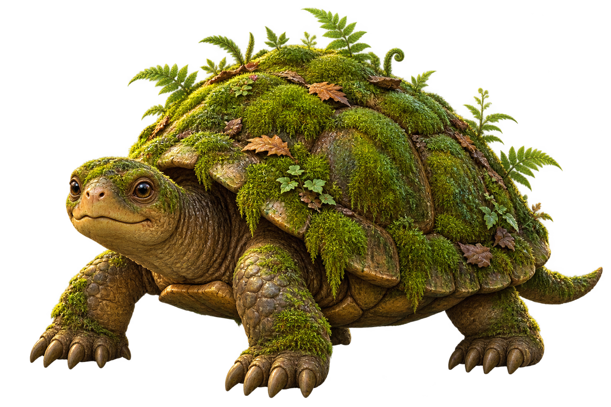
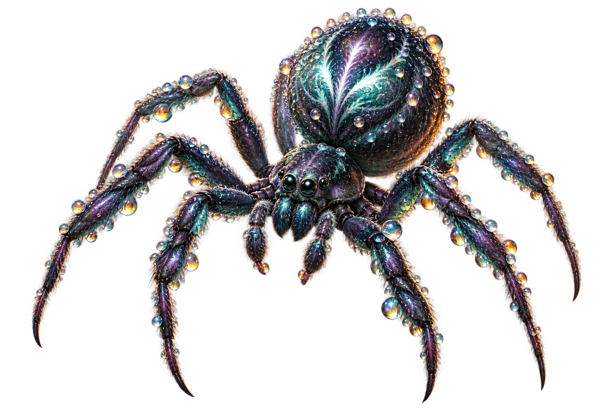
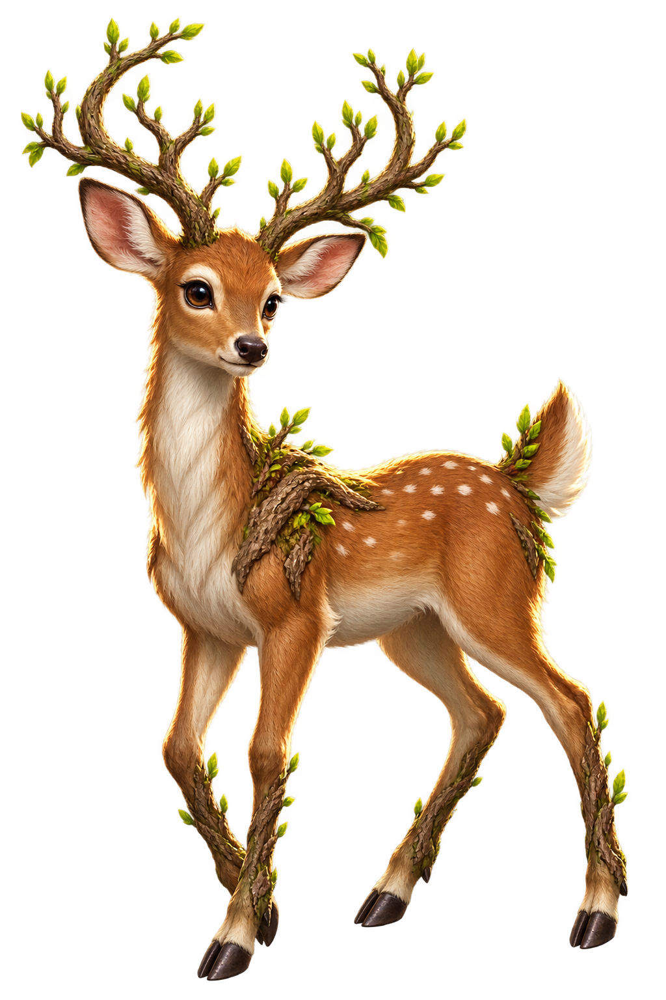
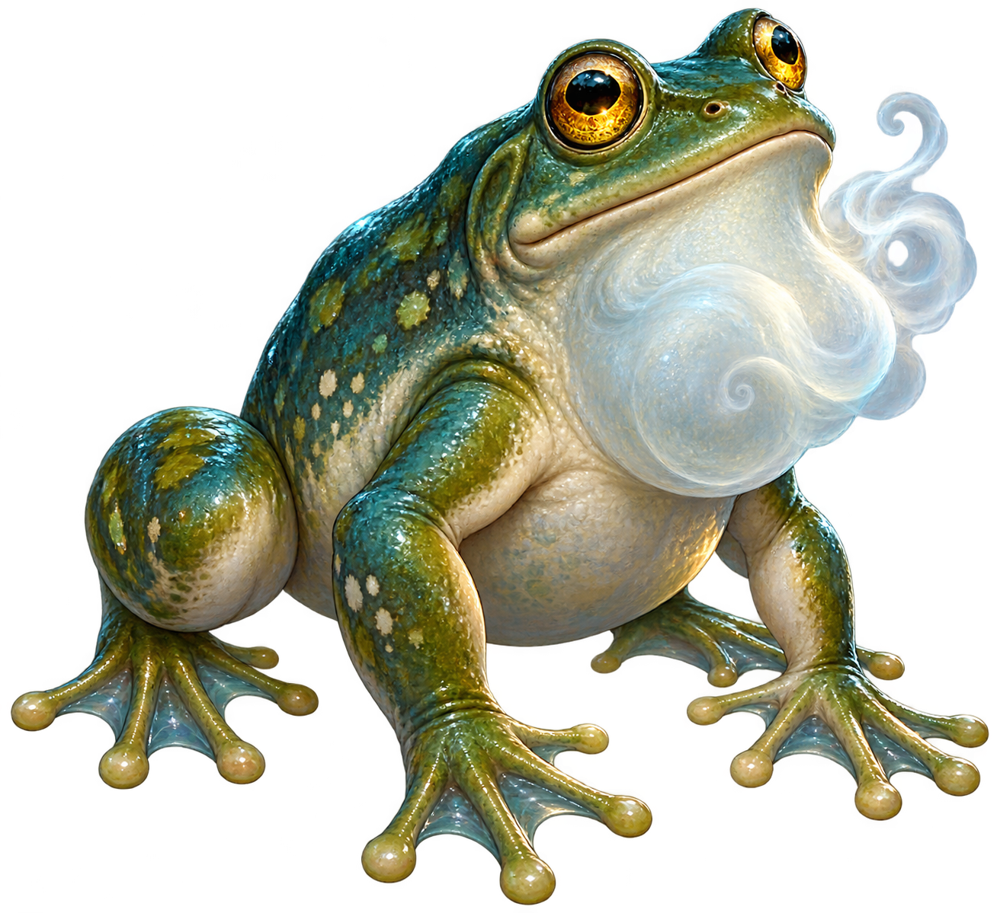
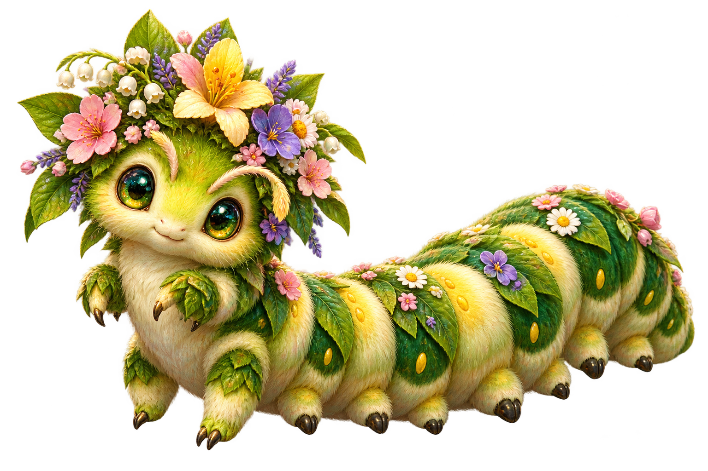
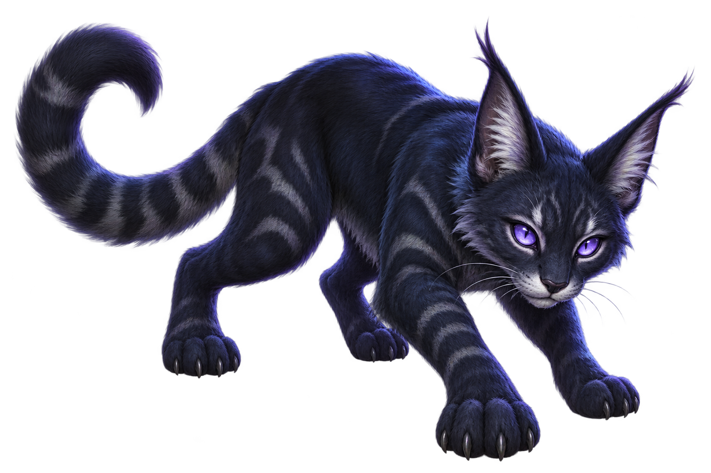
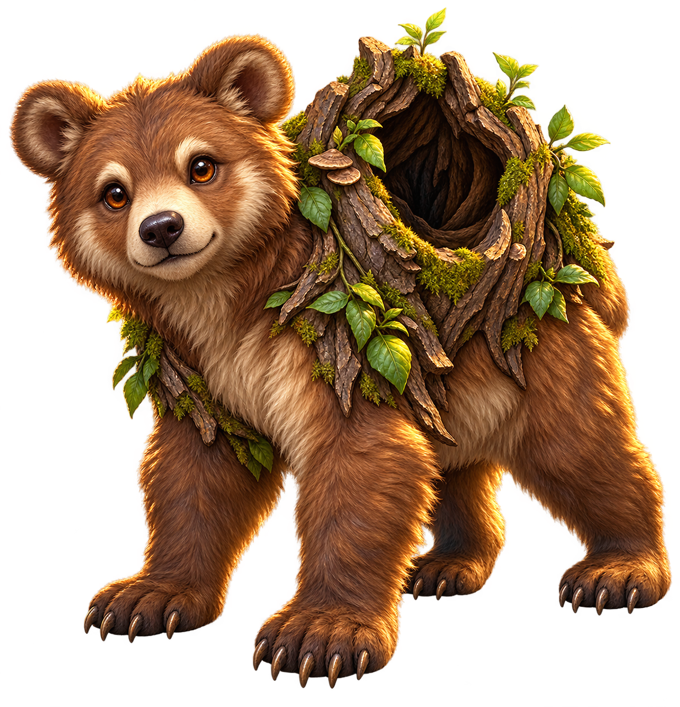

# ART003 B04 Owner Visual Review Pack

Task: `ART003_B04_M035_M044_CANONICAL_MONSTER_ART_PRODUCTION_001`

Production base: `ART003_B03_R1_HEAD=701d4de5992ccf008b4071ee0de0c0cfcbc1382d`

This pack contains exactly the ten F036-planned B04 production candidates. Each image below references the selected final PNG bytes directly from its canonical asset path. No resize, crop, recompression, color adjustment, retouch, or metadata rewrite is performed by this review pack.

Owner visual review status for every row is **PENDING**. Codex technical and continuity QA do not constitute Owner approval. The Owner decision for each row must be exactly `PASS`, `REVISE`, or `REJECT`. F035 Zone `Z4` is planning metadata only and does not grant runtime or gameplay authority.

| M-ID | Canonical name | Planning zone | Final asset path | SHA-256 | Identity note | Technical QA | Owner review |
|---|---|---:|---|---|---|---|---|
| M035 | Mist-tail Fox | Z4 | `art/monsters/M035_mist_tail_fox.png` | `2139DD735189B7EE620470A0ADAB1A8B3171617CB9FF518310B4B85C4EF06B48` | Russet forest fox with a cream chest, moss accents, and an oversized plume tail fading into pale mist. | PASS | PENDING |
| M036 | Moonleaf Moth | Z4 | `art/monsters/M036_moonleaf_moth.png` | `1EEED20F6A18F602364DC62AB457920050B364EAA5760D789659D49E365F277A` | Nocturnal moth with rounded indigo leaf-pattern wings, moon-crescent markings, feathery antennae, and a fuzzy body. | PASS | PENDING |
| M037 | Vineclaw Beast | Z4 | `art/monsters/M037_vineclaw_beast.png` | `2B0FA587B9C1469AB4239E955D646B9635C8DC7C141E1B9E84D19757C70071F2` | Broad quadrupedal woodland beast with shaggy umber fur, leafy mane, bark growth, and vine-wrapped oversized foreclaws. | PASS | PENDING |
| M038 | Mossback Turtle | Z4 | `art/monsters/M038_mossback_turtle.png` | `8DBF1A3B3AC64159F42E1B3C1B27C67437A4B964254C9D96D3F4C320BDD896EF` | Sturdy turtle with a rounded shell carpeted in layered moss, fern shoots, woodland leaves, and olive-brown skin. | PASS | PENDING |
| M039 | Dewdrop Spider | Z4 | `art/monsters/M039_dewdrop_spider.png` | `43AF530C228551E9F91E430A4159D0ECB91716DE356D41A1762AEC9A8AF36C2E` | Eight-legged orb-weaver with charcoal-violet chitin, a pearly abdomen, fine hairs, and luminous dew beads. | PASS | PENDING |
| M040 | Twig Deer | Z4 | `art/monsters/M040_twig_deer.png` | `0ADEE00D4858DFE66FFB28F7FA6DB70EBA3C91743513CE1168C3D1ABB73BC379` | Graceful tawny deer with bark-textured lower limbs and branching budding twig antlers. | PASS | PENDING |
| M041 | Fogwhistle Frog | Z4 | `art/monsters/M041_fogwhistle_frog.png` | `418F3240A9F0E50DCAFEE11485B4471EFFC744C293963BFA397A916E2563C635` | Plump teal-olive frog with webbed feet, golden eyes, pebbled skin, and a pale fog curl at its throat pouch. | PASS | PENDING |
| M042 | Bloomcrown Caterpillar | Z4 | `art/monsters/M042_bloomcrown_caterpillar.png` | `1F054B4CF4B66758BC72A38713F92FB16F4ABF64D94114DAF657E2694D4EB4A2` | Plump segmented yellow-green caterpillar with many prolegs, soft fuzz, leaf details, and a blossom crown. | PASS | PENDING |
| M043 | Shadowstep Cat | Z4 | `art/monsters/M043_shadowstep_cat.png` | `FC92B7D3A9FD343BDCF6AC065342913D1E8D596FC7E852B8627E036717695181` | Sleek blue-black wildcat with a low stalking silhouette, tall tufted ears, oversized paws, and violet eyes. | PASS | PENDING |
| M044 | Hollowtree Cub | Z4 | `art/monsters/M044_hollowtree_cub.png` | `920159D38C2A3C72575CD9B227D959FFF6C4F76E4E635CF95E061EB1956D736E` | Warm brown bear cub with sturdy paws and a natural bark-textured hollow-tree mantle with leafy shoots. | PASS | PENDING |

## Images

### M035 — Mist-tail Fox

### M036 — Moonleaf Moth

### M037 — Vineclaw Beast

### M038 — Mossback Turtle

### M039 — Dewdrop Spider

### M040 — Twig Deer

### M041 — Fogwhistle Frog

### M042 — Bloomcrown Caterpillar

### M043 — Shadowstep Cat

### M044 — Hollowtree Cub

## Byte and authority boundary

- `REVIEW_PACK_BYTES_EQUAL_FINAL_ASSETS=YES`: every image is a direct relative reference to the staged final asset path.
- The ten image files are new B04 candidates; B01, B02, B03, and M022 are not regenerated or edited.
- No candidate is runtime-mapped or gameplay-authoritative.
- No MonsterCatalog, F009, combat, stats, database, Production, release, or LC Genesis work is included.
- Owner review remains pending until the Owner records a per-ID decision.
