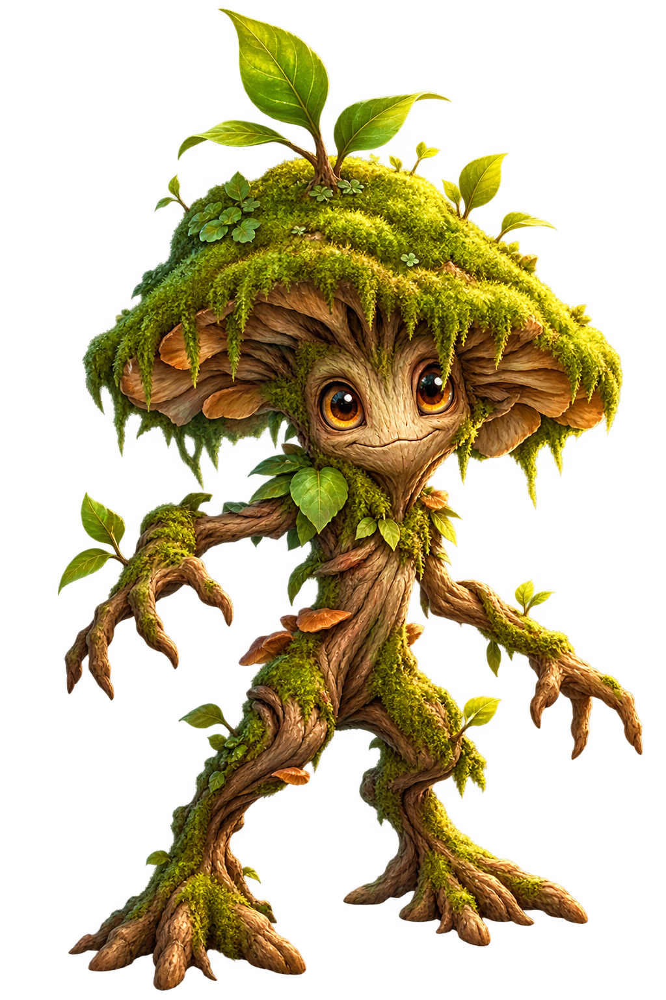
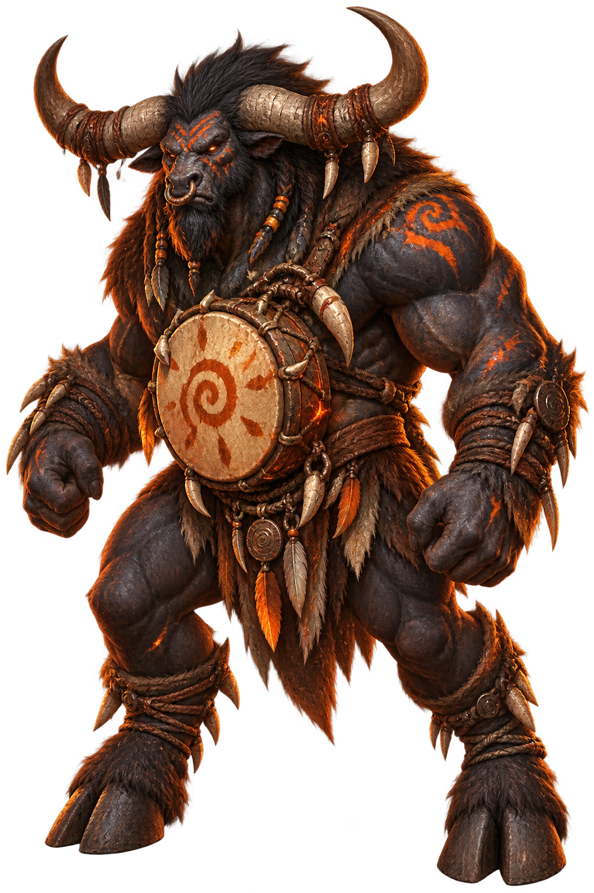
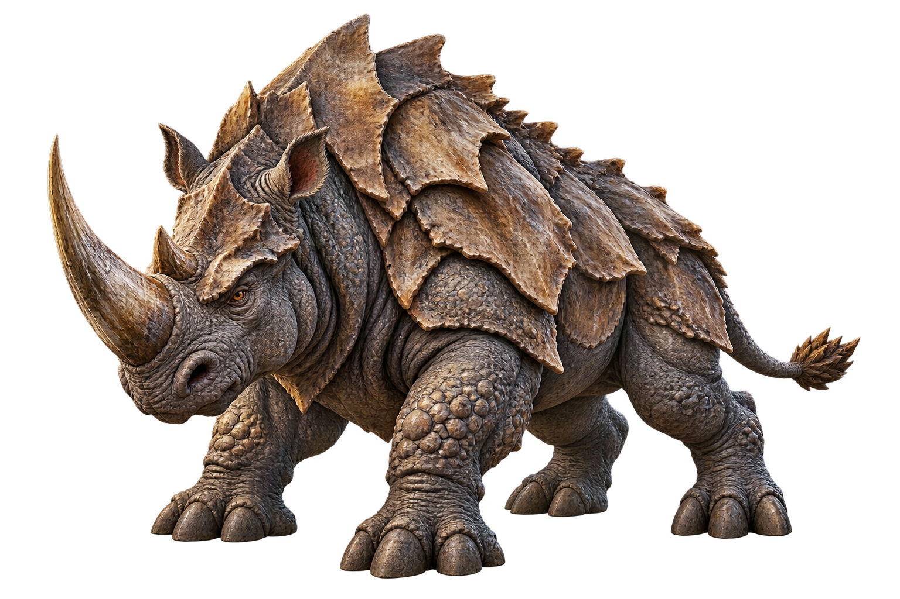
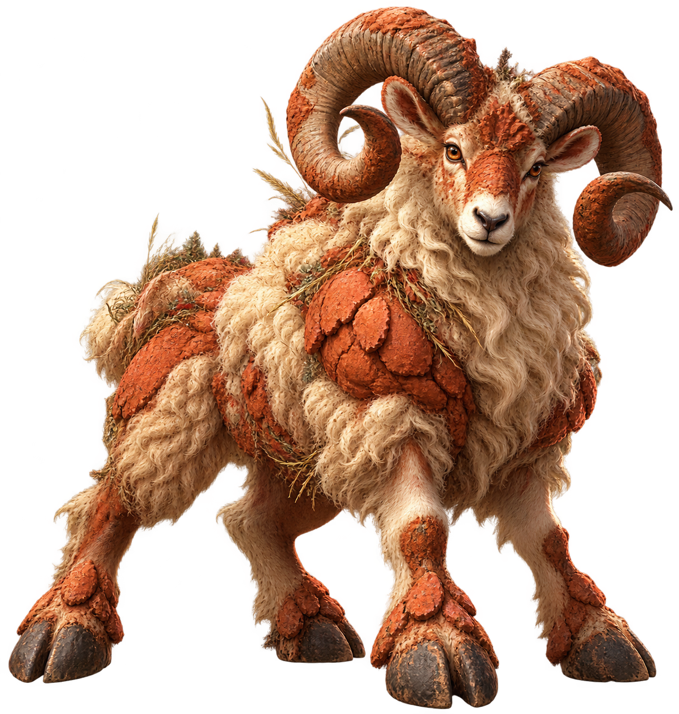
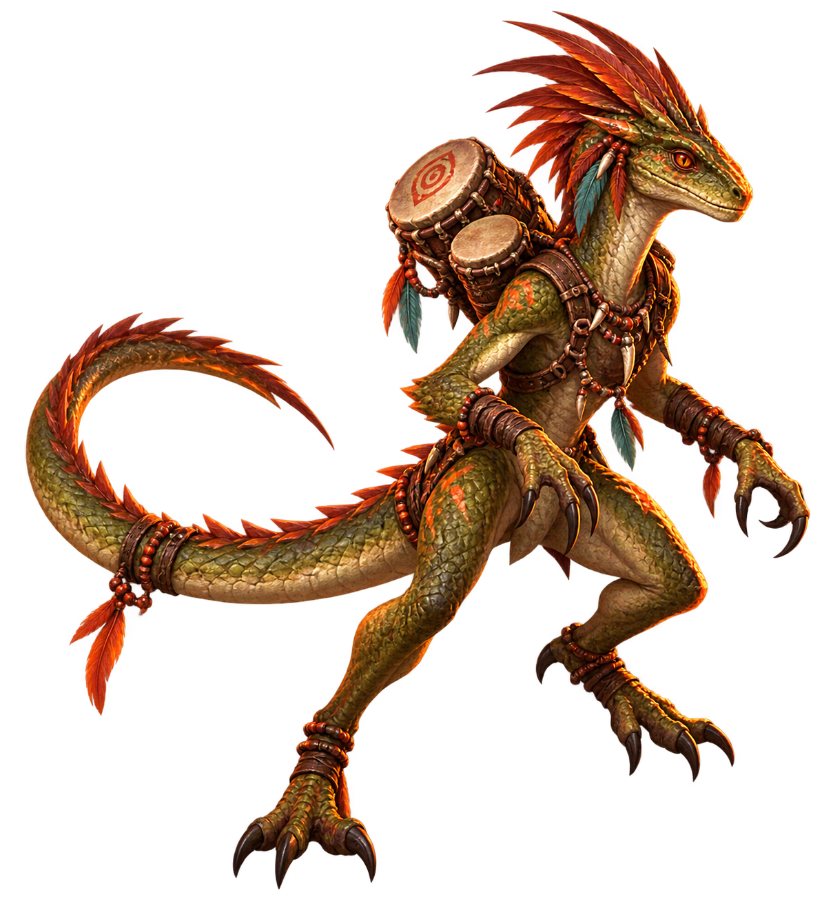
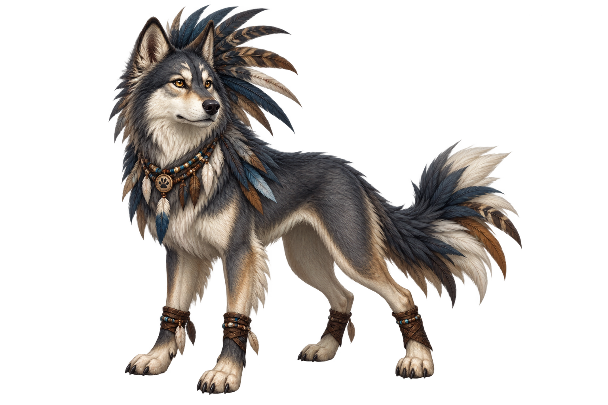
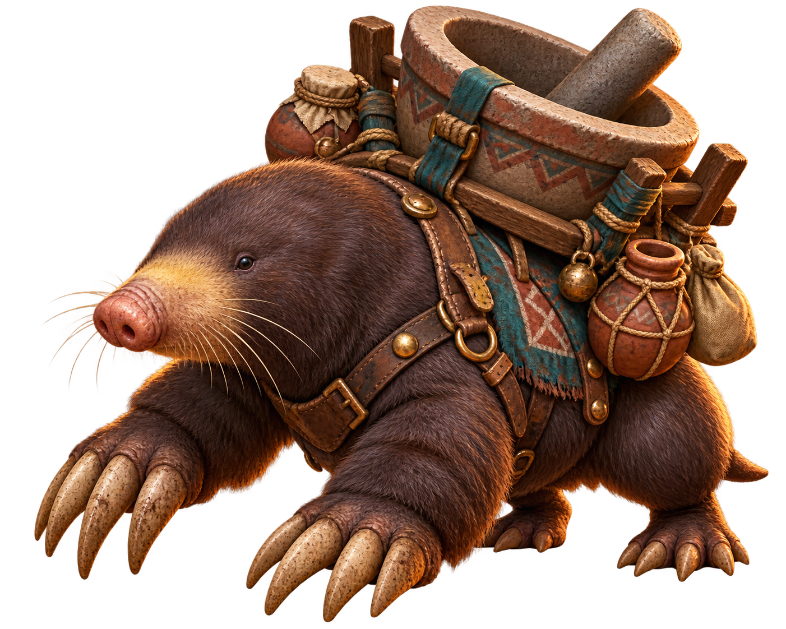
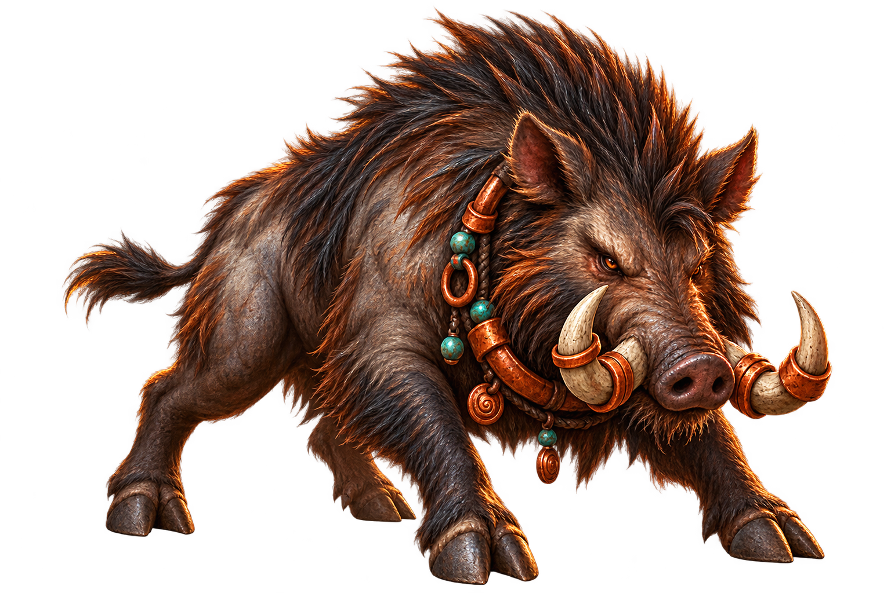
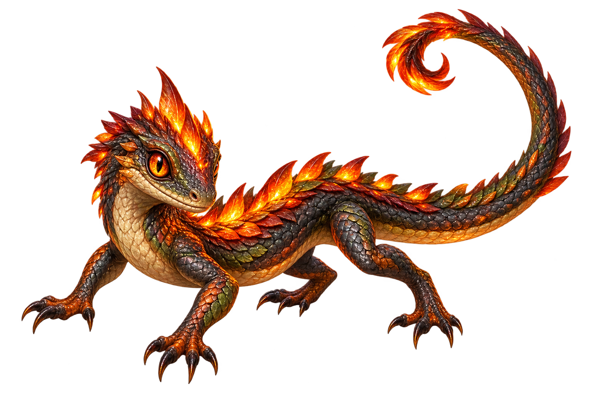
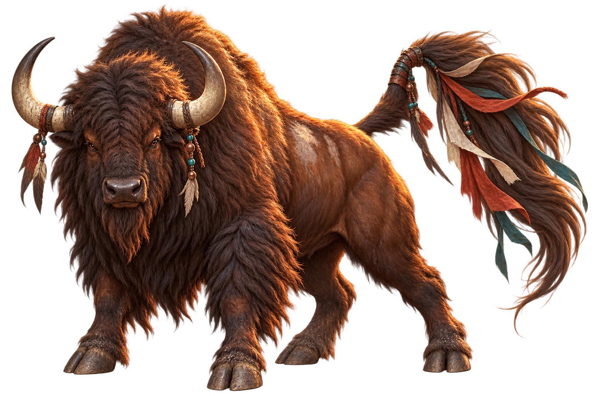

# ART003 B05 Owner Visual Review Pack

Task: `ART003_B05_M045_M055_CANONICAL_MONSTER_ART_PRODUCTION_001`

Batch: `ART003_B05`

Production base: `ART003_B04_R1_HEAD=acdeed171dc49f0eacae9c49cd9a2db299bd0125`

Planning authority: `F035_HEAD=195f3376e107559817e054476b076e471c211731`, `F036_HEAD=36eec98e972e5ed5e40acda83795ac1569e6eb1e`

F035 planning-zone distribution: `Z4=1`, `Z5=9`. The planning zone is metadata only; it is not gameplay or runtime authority.

This pack contains exactly the ten B05 production candidates in the required order. Each image is a direct relative reference to the final PNG bytes staged at its canonical asset path. No resize, crop, recompression, color adjustment, retouch, metadata rewrite, or regeneration is performed by this pack.

`REVIEW_PACK_BYTES_EQUAL_FINAL_ASSETS=YES`

Owner visual review status: **PENDING** (`0/10`). The review decision for each row remains open as `PASS`, `REVISE`, or `REJECT`.

| M-ID | Canonical name | Planning zone | Source description | Final asset path | SHA-256 | Identity note | Technical QA | Owner review |
|---|---|---:|---|---|---|---|---|---|
| M045 | Mosscap Sapling | Z4 | forest sapling | `art/monsters/M045_mosscap_sapling.png` | `F6C892BEB99EFE739C07B3211C9FDFB76E22286A4A29939AB5E3B43E13CAE23D` | Moss-covered sapling creature with a compact bark trunk, root feet, twig arms, expressive amber eyes, and a layered leafy moss cap. | PASS | PENDING |
| M047 | Ember Drum Brute | Z5 | drum clan | `art/monsters/M047_ember_drum_brute.png` | `E8AC3D50ADA48770C0E63243810A1D4D3C9373C72AD7DF44F96CE31685512544` | Broad horned charcoal clan brute with ember-orange markings and a prominent ceremonial drum harness. | PASS | PENDING |
| M048 | Hide-shield Rhino | Z5 | herd guard | `art/monsters/M048_hide_shield_rhino.png` | `58939FBCB802DCD52C436686163FF5B3AC3CFEE4CB677C197E82212C95A0760B` | Massive rhinoceros with a single horn, thick pebbled hide, and layered natural shoulder plates forming a shield-like silhouette. | PASS | PENDING |
| M049 | Redclay Ram | Z5 | clay herd | `art/monsters/M049_redclay_ram.png` | `8939766175F0CDC9C7221F9726FD6842273361A5A355B9A31BEFA1B049061B37` | Powerful terracotta-coated ram with curled horns, cream wool, and cracked red-clay plates across its body and hooves. | PASS | PENDING |
| M050 | War Drum Lizard | Z5 | drum lizard | `art/monsters/M050_war_drum_lizard.png` | `45F2401FE8FECA9A0B9A034358F5F7C380A2A1486FD1691DCDB09770FB3E5B4C` | Lean bipedal olive lizard with a long countercurved tail, swept ember crest, and twin drums mounted to its back. | PASS | PENDING |
| M051 | Feathercrest Hound | Z5 | clan hound | `art/monsters/M051_feathercrest_hound.png` | `1A77D71CAC2758B10C794004F1F98D15D819918935CC8C7000133A9A4AA77A56` | Slate-and-cream wolf-hound with a tall layered feather crest, alert stance, and beaded clan collar. | PASS | PENDING |
| M052 | Mortar Mole | Z5 | clan hauler | `art/monsters/M052_mortar_mole.png` | `52754CA054F70E7C433B5F1D49A1319586444B8F2488F26A9AFA5D653787B697` | Low broad mole with huge digging claws and a weathered ceramic mortar carried in a wooden back frame. | PASS | PENDING |
| M053 | Copperring Boar | Z5 | clan boar | `art/monsters/M053_copperring_boar.png` | `C78A7BD674E52AD151B6E2541B4CFA6E35FE4734F63CFC7B66350EEEDE61AD52` | Fierce dark bristled boar with curved tusks fitted with multiple hammered copper rings. | PASS | PENDING |
| M054 | Campfire Skink | Z5 | camp reptile | `art/monsters/M054_campfire_skink.png` | `A6E350097A9390CC6A156AAC3BEA004E17732E0535C1E84305D40B73A4B0519C` | Long-tailed charcoal-and-olive skink with glowing ember-shaped dorsal scales and a clear reptile silhouette. | PASS | PENDING |
| M055 | Banner-tail Bison | Z5 | banner herd | `art/monsters/M055_banner_tail_bison.png` | `E3B029FF892A0A7016D48D34F18B7F38887AABC8B38214E18D89A988C80A2870` | Shaggy broad-shouldered bison with curved horns and a long tail finished with flowing clan-colored cloth strips. | PASS | PENDING |

## Images

### M045 — Mosscap Sapling

### M047 — Ember Drum Brute

### M048 — Hide-shield Rhino

### M049 — Redclay Ram

### M050 — War Drum Lizard

### M051 — Feathercrest Hound

### M052 — Mortar Mole

### M053 — Copperring Boar

### M054 — Campfire Skink

### M055 — Banner-tail Bison

## Authority and scope boundary

- These are production candidates pending Owner visual decisions; this task does not publish Owner-approved canonical art.
- B01, B02, B03, B04, and M022 are protected and are not regenerated or edited.
- No B05 asset is runtime-mapped or gameplay-authoritative.
- No MonsterCatalog, stats, combat, F009, release, database, Production, deployment, or LC Genesis work is included.
- M046 is intentionally excluded from B05.
