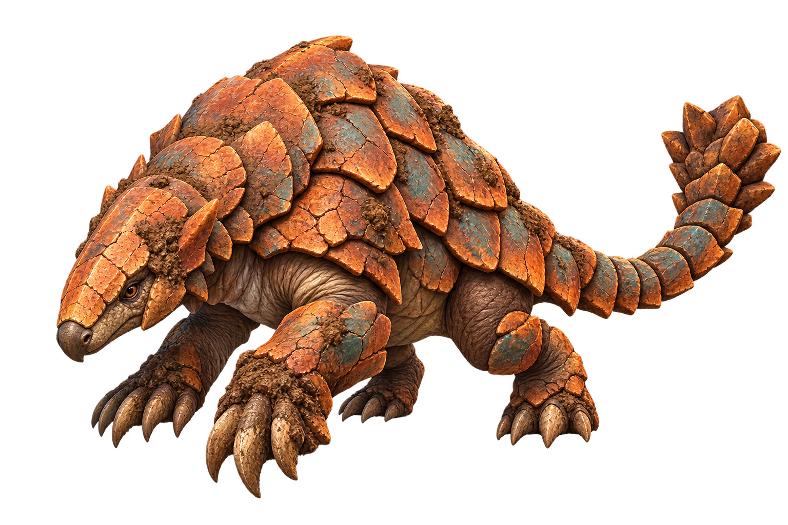
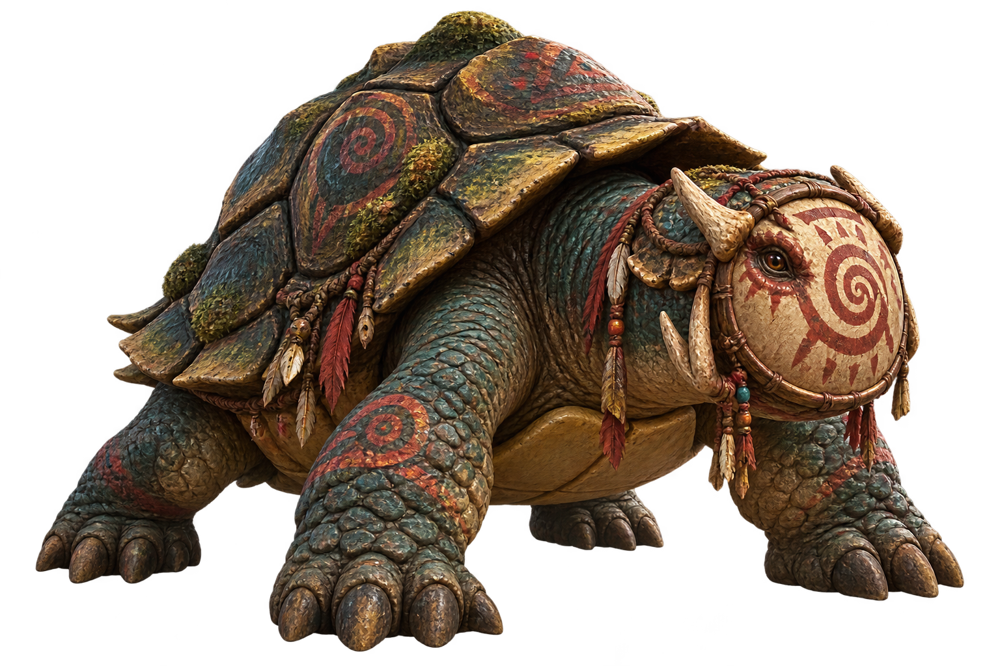
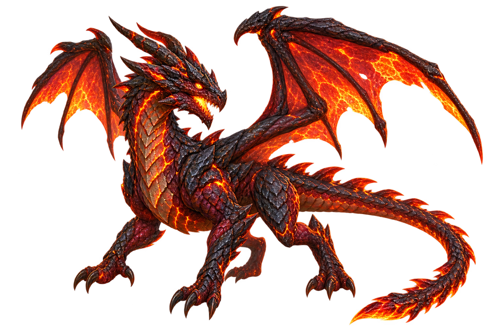
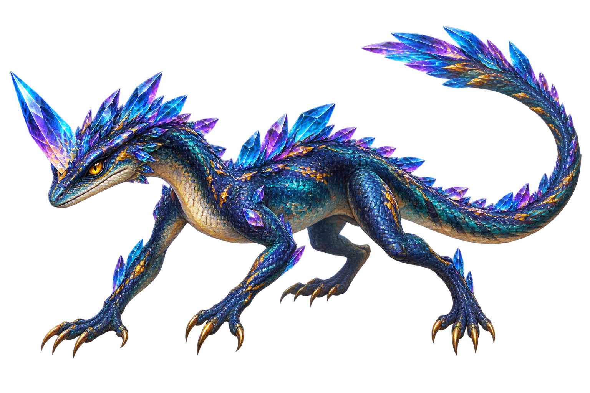
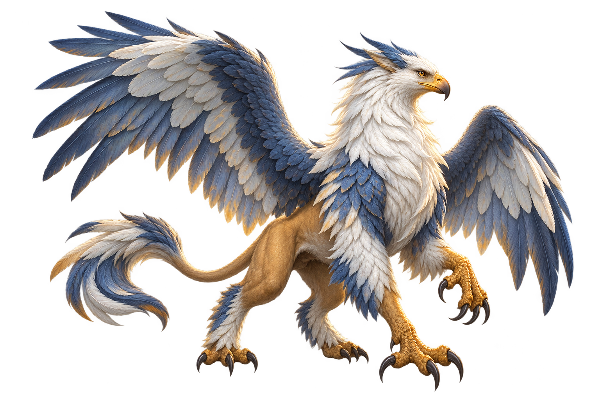
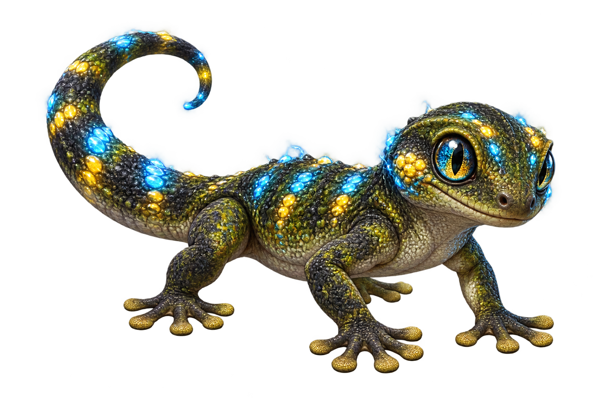
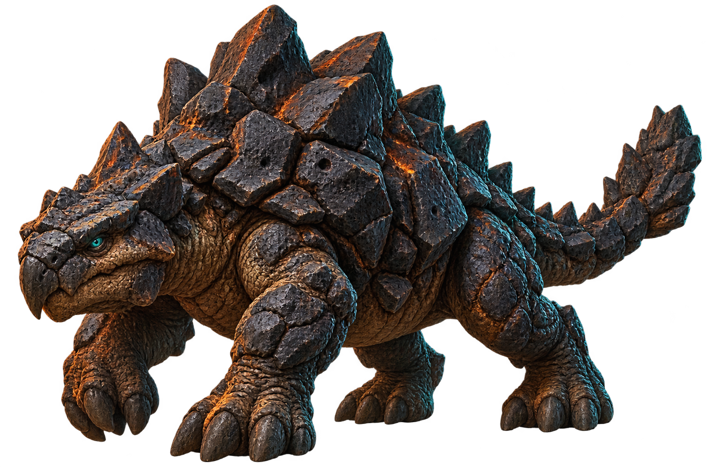
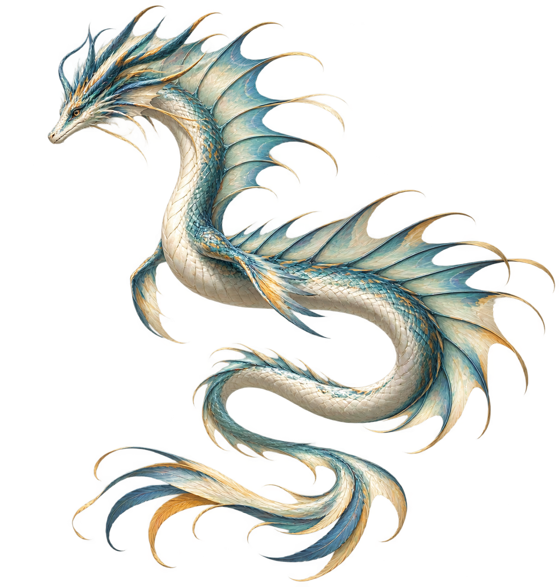
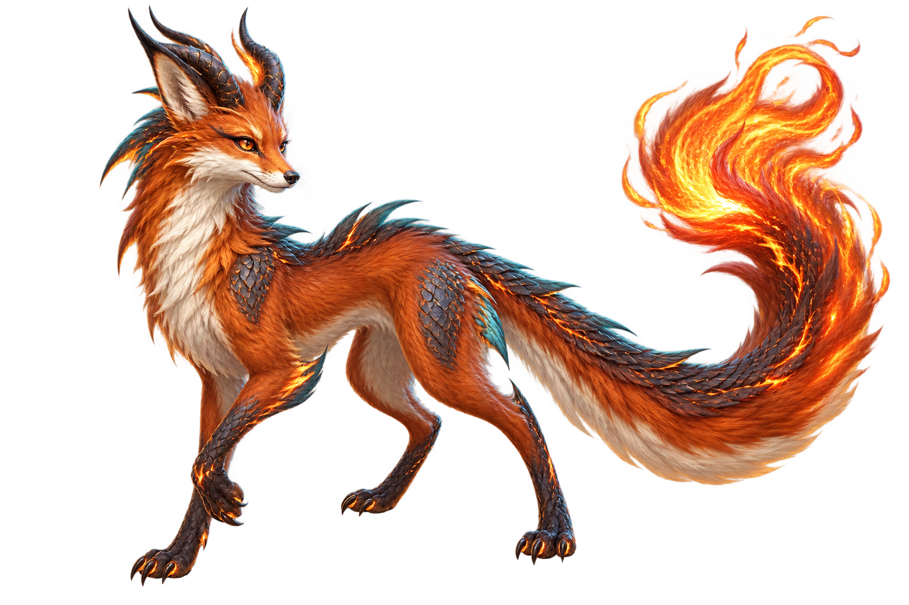
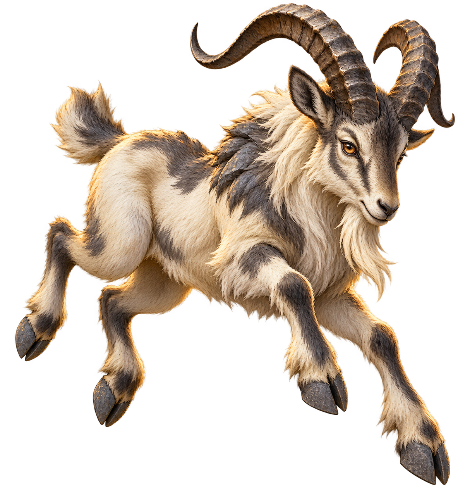

# ART003 B06 Owner Visual Review Pack — Canonical Publication Record

Task: `ART003_B06_R1_OWNER_PASS_FREEZE_AND_CANONICAL_ART_PUBLICATION_001` 
Source task: `ART003_B06_M056_M066_CANONICAL_MONSTER_ART_PRODUCTION_001` 
Batch: `ART003_B06` 
Production base: `ac3d1abecd8a552aaf38cb99fdd3677f77fc2e57` 
B06 source head: `edc1b51b45fa96a52f90bf363b7208cc99afbc22` 
F035 planning head: `195f3376e107559817e054476b076e471c211731` 
F036 batch-plan head: `36eec98e972e5ed5e40acda83795ac1569e6eb1e` 
F035 zone distribution: `Z3=1, Z5=2, Z6=7`

This pack contains exactly ten B06 candidates, in exact ID order. `M058` is
intentionally excluded because it is an existing protected runtime identity.

Owner visual review status: **PASS** (`10/10`). 
Owner revision required: **NO** 
Review decision per candidate: `PASS`, `REVISE`, or `REJECT` 
Review-pack bytes equal staged final assets: **YES**

## Review matrix

| ID | Canonical name | Zone | Identity intent | Final asset | SHA-256 | Technical QA | Owner review |
|---|---|---|---|---|---|---|---|
| M056 | Mudplate Armadillo | Z5 | Clay burrower: low armadillo silhouette, terracotta mud plates, broad digging claws, segmented tail. | `art/monsters/M056_mudplate_armadillo.png` | `06FBD5891FB6BB70F00679677F1DD1334E106F2934A522D5DB3758BCAC08E589` | PASS | PASS |
| M057 | Drumface Tortoise | Z5 | Clan tortoise: rounded shell, circular drum-like facial plate, clan markings, short strong legs. | `art/monsters/M057_drumface_tortoise.png` | `62D492E76496168B747DAAC957825B1EE23C8ACB9FE09A7CBC59337B15EB2439` | PASS | PASS |
| M059 | Lava-wing Drake | Z6 | Lava drake: quadrupedal drake, compact bat-like wings, obsidian-maroon scales, molten seams. | `art/monsters/M059_lava_wing_drake.png` | `C17BA3942280FAB2DF587BA78DA77673AFAE65BDED6B6618FA5AD2C5B86CDB2E` | PASS | PASS |
| M060 | Crystalhorn Lizard | Z3 | Crystal lizard: sleek four-legged body, one faceted brow horn, azure-violet crystal ridges, long tail. | `art/monsters/M060_crystalhorn_lizard.png` | `B523807D9D4BEC9ED85298FD41E8EFB9C81E4C409DFF88CF40FBA14AC66753D5` | PASS | PASS |
| M061 | Cloudclaw Gryphon | Z6 | Sky gryphon: eagle head, blue-white wings, lion torso, cloud plume mane, clearly readable talons. | `art/monsters/M061_cloudclaw_gryphon.png` | `7A7C658757B7CB2F81A3BD549B375F49EC4D756D94FF36D8A58A991273EC872B` | PASS | PASS |
| M062 | Sparkscale Gecko | Z6 | Spark gecko: compact low gecko, broad toe pads, curled tail, blue-yellow luminous spark scales. | `art/monsters/M062_sparkscale_gecko.png` | `71206DFB482138B723119D6E27A1F5CE013C467818BB1F09B0D7E604FF1C60B1` | PASS | PASS |
| M063 | Basalt Shellbeast | Z6 | Basalt beast: heavy low reptilian body, porous black-rock carapace, pillar legs, jagged ridge. | `art/monsters/M063_basalt_shellbeast.png` | `28436C001B30C91B07AE51EB07D1DD3A63FF8E58CFAF922A3B725DDD3DDF2AFF` | PASS | PASS |
| M064 | Windspine Serpent | Z6 | Wind serpent: long airborne coil, pale teal scales, continuous sail-like dorsal wind spines, no conventional wings. | `art/monsters/M064_windspine_serpent.png` | `7B6B4F9A4C9D1EC01527130C409541341CEED1AF1E72144DC80D01443CDCD63A` | PASS | PASS |
| M065 | Ember-tail Foxdragon | Z6 | Foxdragon: nimble russet fox body, small dragon horns and scales, contained ember-glowing tail tip. | `art/monsters/M065_ember_tail_foxdragon.png` | `E2332D28F2B5867A3949BFD7BCC321D81F12236219A700F2616B43E74E1900A4` | PASS | PASS |
| M066 | Cliffskip Goat | Z6 | Cliff goat: agile mountain-goat silhouette, large swept horns, slate hooves, cliff-colored fur. | `art/monsters/M066_cliffskip_goat.png` | `58A9AF404274347B16765C4D675F6D4559D31DC13A6DEEA058639A4AAE0E81E7` | PASS | PASS |

## Visual candidates

### M056 — Mudplate Armadillo

Clay-burrower identity: broad low quadruped, layered terracotta mud plates,
blunt armored head, digging claws, and segmented tail.

Final asset: `art/monsters/M056_mudplate_armadillo.png` 
SHA-256: `06FBD5891FB6BB70F00679677F1DD1334E106F2934A522D5DB3758BCAC08E589`

### M057 — Drumface Tortoise

Clan-tortoise identity: rounded layered shell, circular drum-like facial plate,
painted clan markings, and short powerful legs.

Final asset: `art/monsters/M057_drumface_tortoise.png` 
SHA-256: `62D492E76496168B747DAAC957825B1EE23C8ACB9FE09A7CBC59337B15EB2439`

### M059 — Lava-wing Drake

Lava-drake identity: quadrupedal drake, compact bat-like wings, obsidian-maroon
scales, molten seams, clawed feet, and a long tail.

Final asset: `art/monsters/M059_lava_wing_drake.png` 
SHA-256: `C17BA3942280FAB2DF587BA78DA77673AFAE65BDED6B6618FA5AD2C5B86CDB2E`

### M060 — Crystalhorn Lizard

Crystal-lizard identity: lean four-legged lizard, one faceted brow horn,
azure-violet crystal ridges, and a long tail.

Final asset: `art/monsters/M060_crystalhorn_lizard.png` 
SHA-256: `B523807D9D4BEC9ED85298FD41E8EFB9C81E4C409DFF88CF40FBA14AC66753D5`

### M061 — Cloudclaw Gryphon

Sky-gryphon identity: eagle head and beak, broad blue-white wings, lion torso,
cloudlike neck plume, and hooked talons.

Final asset: `art/monsters/M061_cloudclaw_gryphon.png` 
SHA-256: `7A7C658757B7CB2F81A3BD549B375F49EC4D756D94FF36D8A58A991273EC872B`

### M062 — Sparkscale Gecko

Spark-gecko identity: compact low gecko, expressive eyes, broad toe pads,
curled tail, and luminous blue-yellow spark scales.

Final asset: `art/monsters/M062_sparkscale_gecko.png` 
SHA-256: `71206DFB482138B723119D6E27A1F5CE013C467818BB1F09B0D7E604FF1C60B1`

### M063 — Basalt Shellbeast

Basalt-beast identity: heavy low reptilian quadruped, chipped porous black-rock
carapace, thick tail, pillar legs, and jagged dorsal ridges.

Final asset: `art/monsters/M063_basalt_shellbeast.png` 
SHA-256: `28436C001B30C91B07AE51EB07D1DD3A63FF8E58CFAF922A3B725DDD3DDF2AFF`

### M064 — Windspine Serpent

Wind-serpent identity: long pale teal serpentine coil with a continuous fan of
sail-like dorsal spines and no conventional wings.

Final asset: `art/monsters/M064_windspine_serpent.png` 
SHA-256: `7B6B4F9A4C9D1EC01527130C409541341CEED1AF1E72144DC80D01443CDCD63A`

### M065 — Ember-tail Foxdragon

Foxdragon identity: nimble russet fox body, pointed ears, small dragon horns,
subtle shoulder scales, and a contained ember tail tip.

Final asset: `art/monsters/M065_ember_tail_foxdragon.png` 
SHA-256: `E2332D28F2B5867A3949BFD7BCC321D81F12236219A700F2616B43E74E1900A4`

### M066 — Cliffskip Goat

Cliff-goat identity: agile mountain goat, large swept ridged horns,
cream-and-charcoal cliff-colored fur, slate hooves, and readable skipping pose.

Final asset: `art/monsters/M066_cliffskip_goat.png` 
SHA-256: `58A9AF404274347B16765C4D675F6D4559D31DC13A6DEEA058639A4AAE0E81E7`

## Boundary confirmation

- This is art/content production evidence only; planning zones are metadata and not gameplay authority.
- B01–B05 and protected M022 assets remain outside this batch and must remain byte-identical.
- No runtime, MonsterCatalog, gameplay, stats, combat, release, production, database, or Learning Core changes are included.
- Owner visual review is complete: PASS for all ten candidates; canonical publication is recorded for these exact bytes.
- Do not start B07 until the Coordinator accepts B06-R1.
