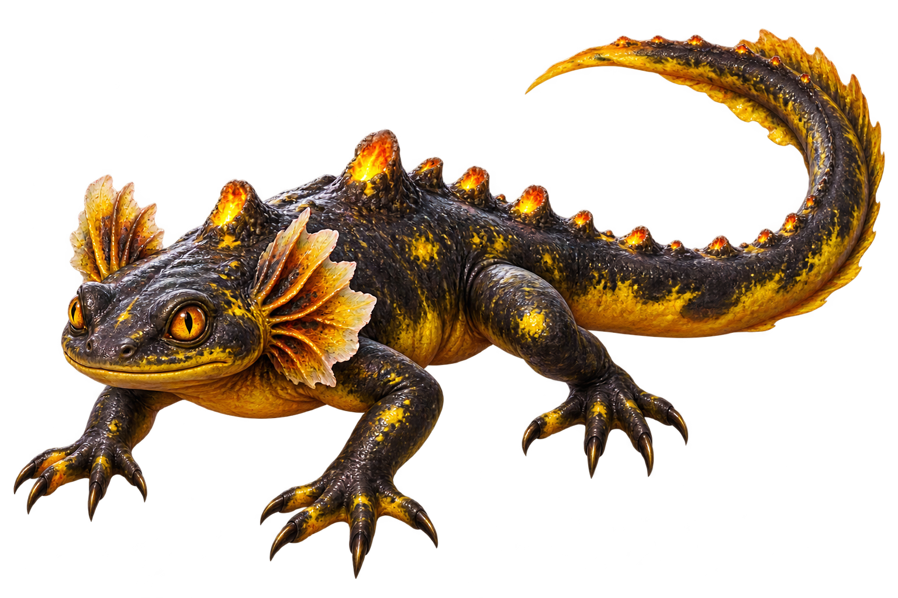
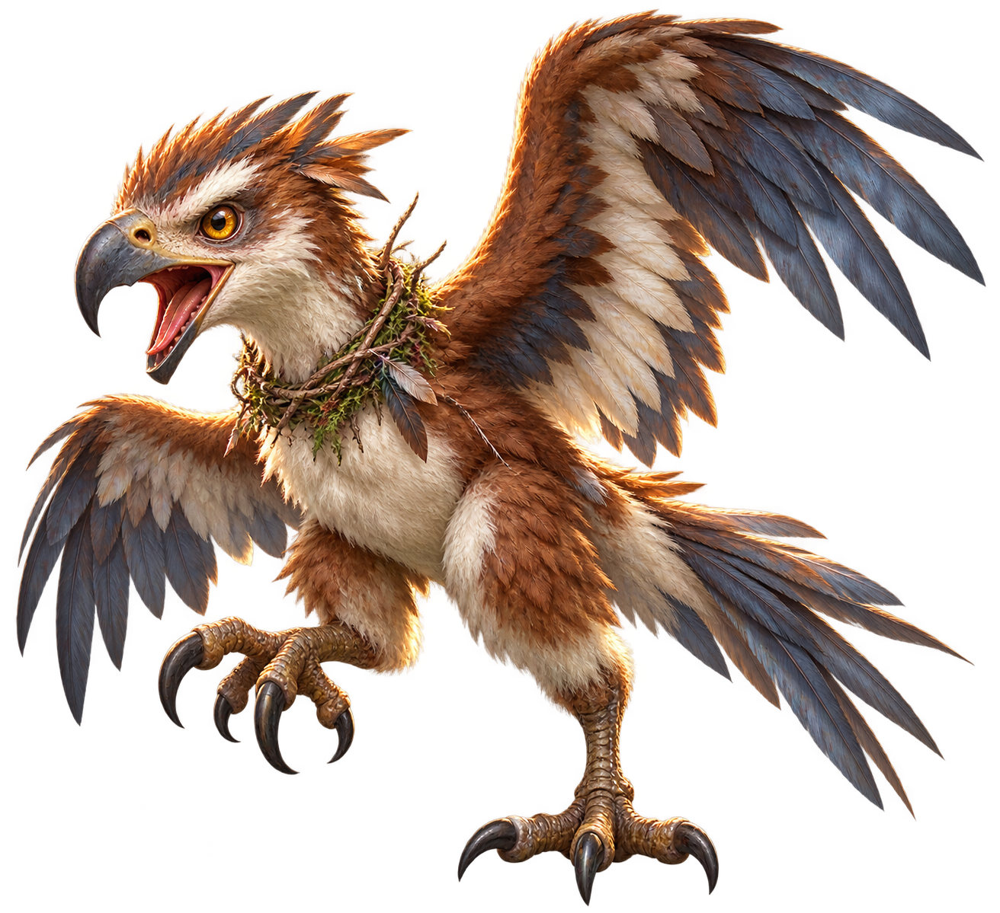
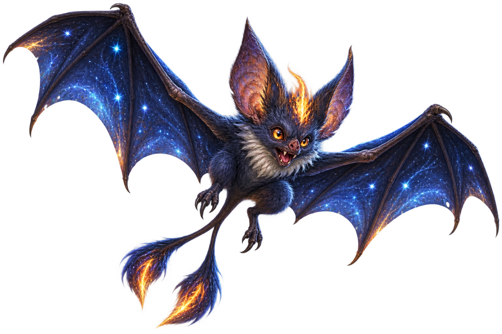
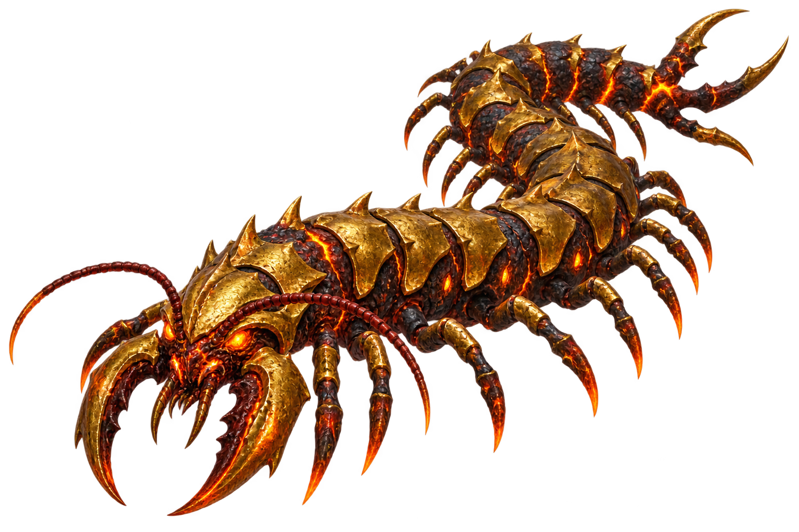
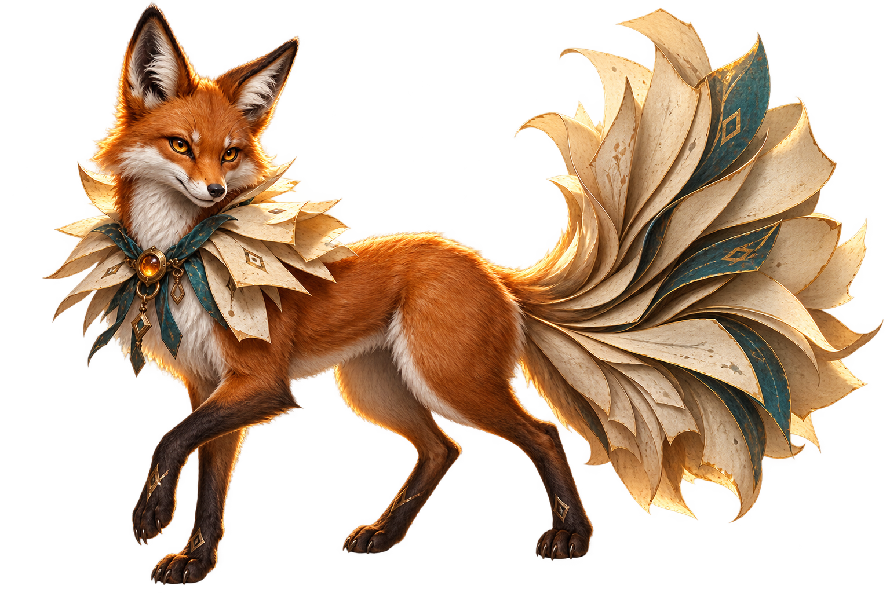
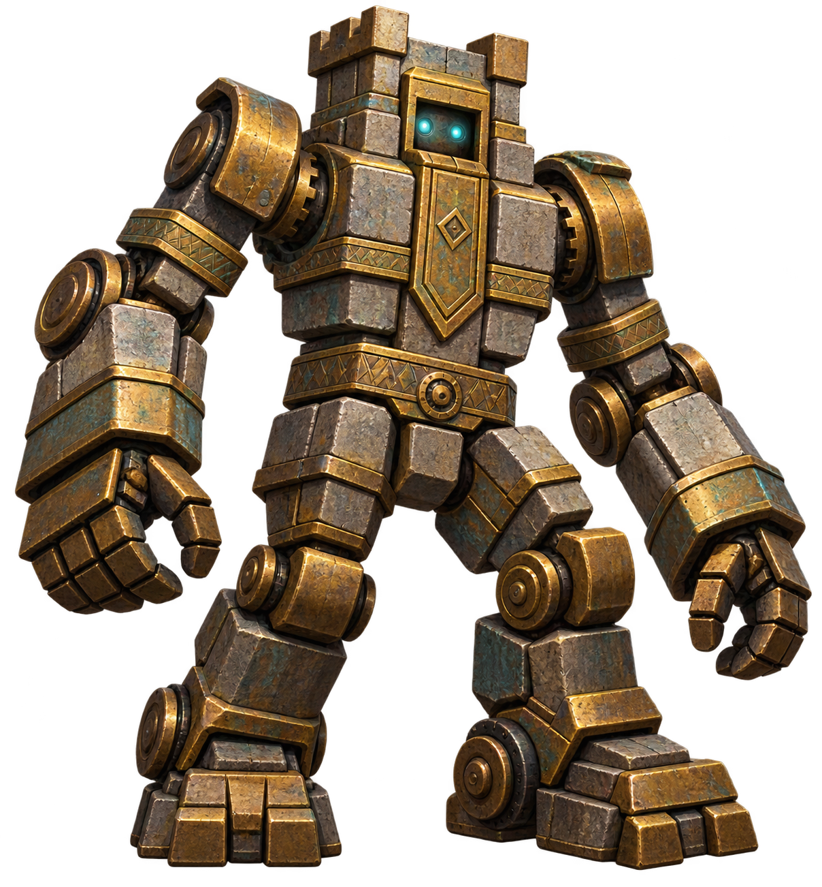
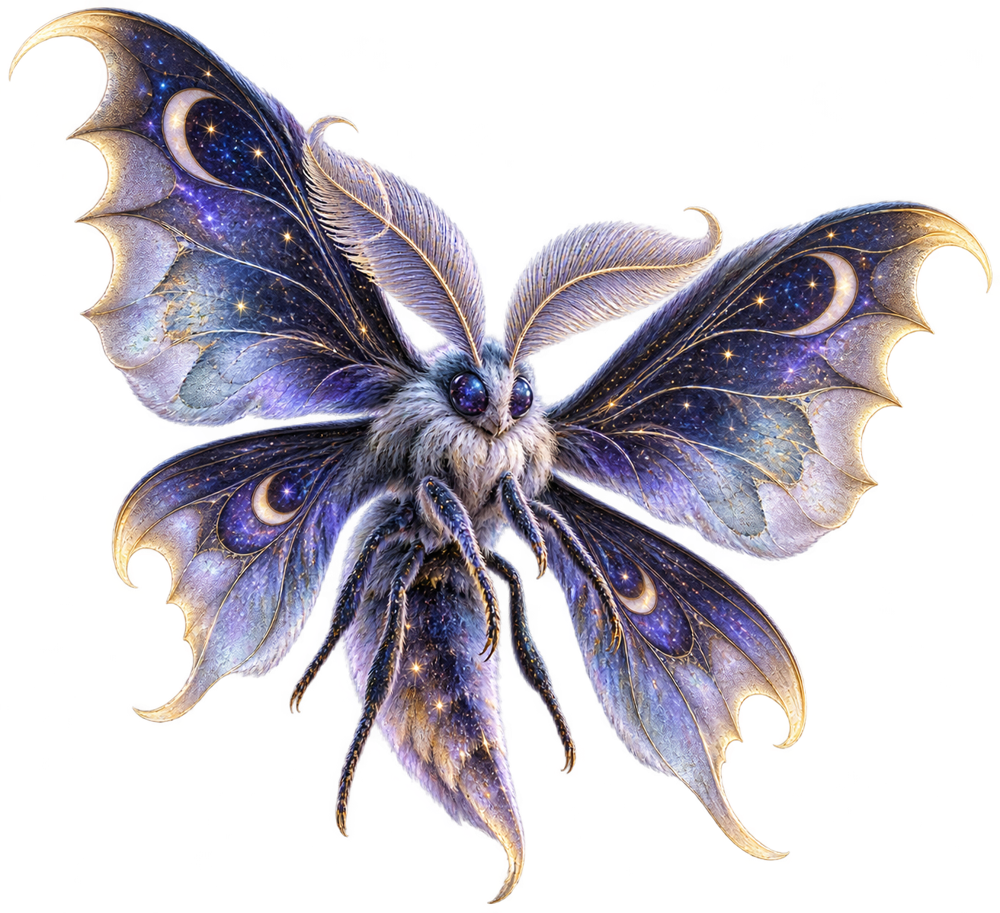
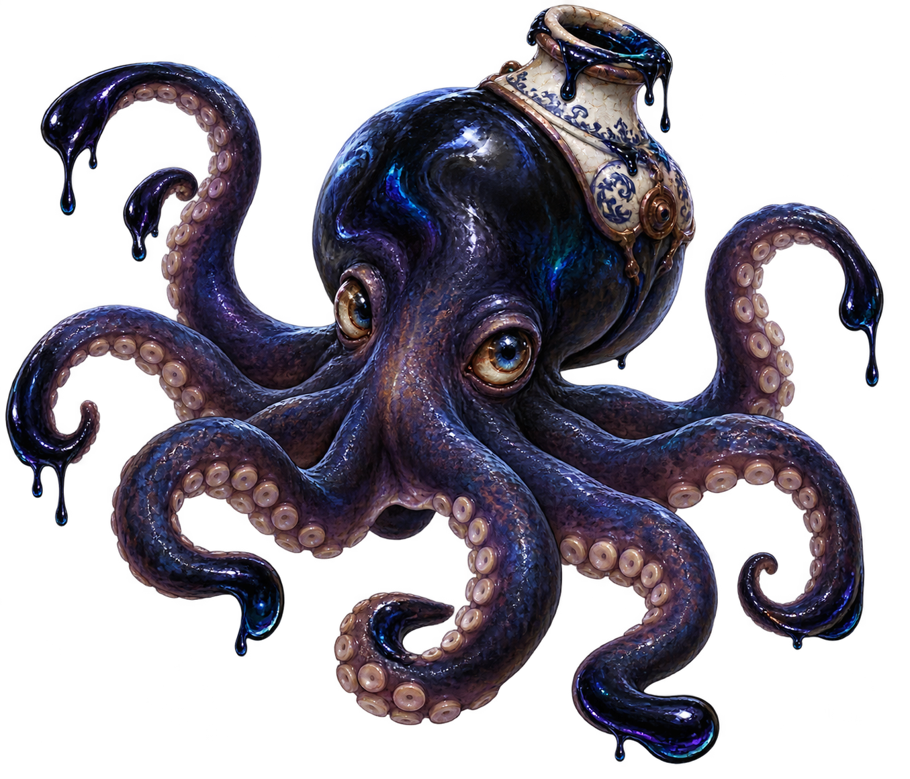
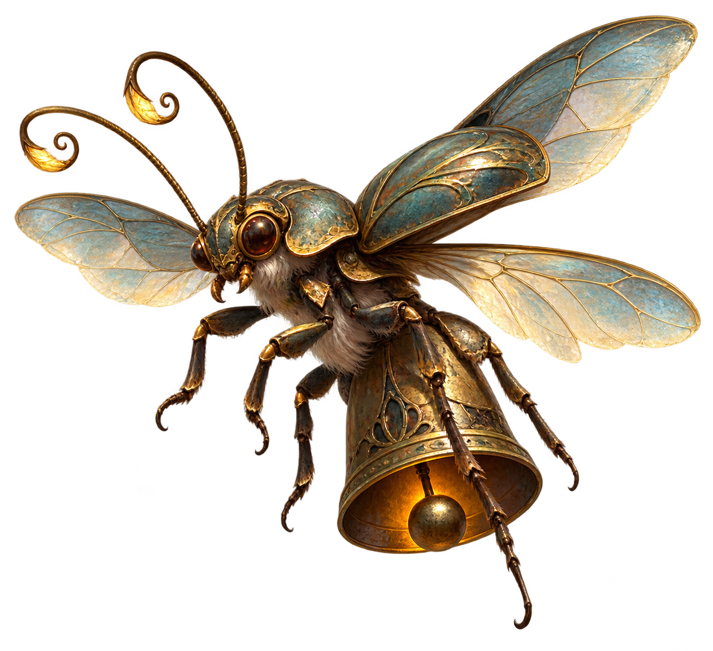
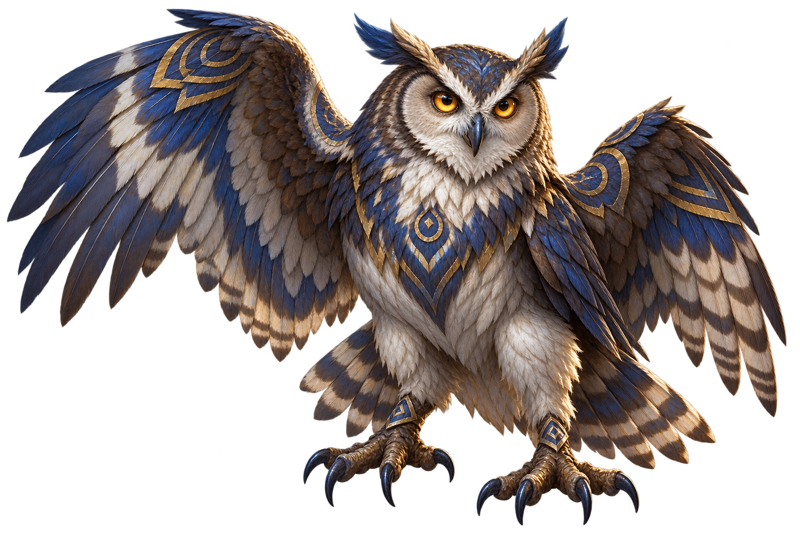

# ART003 B07 Owner Visual Review Pack — Canonical Publication Record

Task: `ART003_B07_R1_OWNER_PASS_FREEZE_AND_CANONICAL_ART_PUBLICATION_001` 
Source task: `ART003_B07_M067_M077_CANONICAL_MONSTER_ART_PRODUCTION_001` 
Batch: `ART003_B07` 
Production base: `89733f3985ef8fc526b27d843a52259cf7aeb5bd` 
B07 source head: `9bd33b9a0628f5983ec9b12afa1a882d4b1b6e69` 
F035 planning head: `195f3376e107559817e054476b076e471c211731` 
F035 assignment SHA-256: `49e704f0c9935056c5614e91feff28d4775c6f98d4b38f1b068639f7d72d5e00` 
F036 batch-plan head: `36eec98e972e5ed5e40acda83795ac1569e6eb1e` 
F035 zone distribution: `Z6=4, Z7=5, Z10=1`

This pack records exactly ten Owner-approved B07 assets in exact ID order.
`M071` is intentionally excluded. The exact reviewed bytes are frozen and
published as canonical ART003 art; they remain runtime-unmapped,
gameplay-nonauthoritative, unmerged, and undeployed.

Owner visual review status: **PASS** (`10/10`) 
Owner revision required: **NO** 
Owner decision per candidate: `PASS`, `REVISE`, or `REJECT` 
Review-pack bytes equal final candidate assets: **YES**

## Review matrix

| ID | Canonical name | Zone | Identity intent | Final asset | SHA-256 | Owner review |
|---|---|---|---|---|---|---|
| M067 | Sulfur Salamander | Z6 | Low volcanic salamander with sulfur vents, frilled gills, long tail, and four splayed clawed feet. | `art/monsters/M067_sulfur_salamander.png` | `23F756F7ADA095F9BFA0293CF243F158F74BE89D4E69A4A38DFB717FAE865F1E` | PASS |
| M068 | Nestling Raptor | Z6 | Fierce young raptor with oversized talons, hooked beak, layered juvenile feathers, and nest-twig collar. | `art/monsters/M068_nestling_raptor.png` | `13B36384D8A2941D6CFE83221E871EE2264D3BDF3C9CCAAA9A7F0FBC8DC35FCF` | PASS |
| M069 | Starflame Bat | Z6 | Celestial bat with angular star-patterned wings, small flame crest, pointed ears, and forked tail tuft. | `art/monsters/M069_starflame_bat.png` | `31E43FCD6711031362E97801DA26E6B74634CE6F538E55C6D43E28ED7B8017D9` | PASS |
| M070 | Molten Gold Centipede | Z6 | Long many-legged volcanic centipede with segmented basalt anatomy, molten-gold plates, and lava seams. | `art/monsters/M070_molten_gold_centipede.png` | `21730552BE6FBD92DD6BA15A721A4A86E0F9DF243EB916FDBFB5094046CEE4F6` | PASS |
| M072 | Pagefox | Z7 | Clever russet fox with a fanned parchment-page tail and ruff, plus abstract non-readable page marks. | `art/monsters/M072_pagefox.png` | `B8B00DE480C6515EDEA9B7787BFDA1E9346648CA1D2313B2B1706B1418D439E6` | PASS |
| M073 | Brass Golem | Z10 | Normal-scale walking tower construct made from brass-banded stone blocks with an inset face and clockwork joints. | `art/monsters/M073_brass_golem.png` | `965473185EB4BF5DCCE812F229E440C5B2EE82D313888ED106225BD9EF38B50B` | PASS |
| M074 | Stardust Moth | Z7 | Broad-winged moth with velvety body, crescent-scalloped wings, and restrained star-dust pattern. | `art/monsters/M074_stardust_moth.png` | `73EE16C6DBCEB2C4C3D65849E4D310D2DB9085EF29CC10B41BF0789AA2F3BE40` | PASS |
| M075 | Inkwell Octopus | Z7 | Squat eight-tentacled octopus with wet indigo skin and an integrated inkwell-like ceramic mantle collar. | `art/monsters/M075_inkwell_octopus.png` | `3F257E3FB7AE89C37A0741057747881067128267F0C0C800FB39E125358722B0` | PASS |
| M076 | Floating Bell Bug | Z7 | Hovering beetle with bell-shaped abdomen, translucent wings, six tucked legs, and visible inner clapper. | `art/monsters/M076_floating_bell_bug.png` | `4B3B1D17DD6DF98837760FBA60FAE5B34A3E59838A0F8C306134D964C40789CF` | PASS |
| M077 | Rune Owl | Z7 | Sturdy owl with partly spread wings, layered feathers, bright eyes, and abstract geometric rune-like markings. | `art/monsters/M077_rune_owl.png` | `BA946E8C94D75F920DA001D568C79CC24679DCB4072677E2B773CB5AF0BF695A` | PASS |

## Visual candidates

### M067 — Sulfur Salamander

Identity intent: low volcanic salamander with charcoal-and-sulfur skin,
frilled cheek gills, dorsal sulfur vents, clawed feet, and a long tail.

Final asset: `art/monsters/M067_sulfur_salamander.png` 
SHA-256: `23F756F7ADA095F9BFA0293CF243F158F74BE89D4E69A4A38DFB717FAE865F1E` 
Zone: `Z6` 
Owner review: **PASS**

### M068 — Nestling Raptor

Identity intent: young raptor with russet-and-cream plumage, oversized talons,
hooked beak, broad wings, and a nest-twig collar.

Final asset: `art/monsters/M068_nestling_raptor.png` 
SHA-256: `13B36384D8A2941D6CFE83221E871EE2264D3BDF3C9CCAAA9A7F0FBC8DC35FCF` 
Zone: `Z6` 
Owner review: **PASS**

### M069 — Starflame Bat

Identity intent: indigo bat with star-speckled angular wings, a contained
amber flame crest, pointed ears, and a forked tail tuft.

Final asset: `art/monsters/M069_starflame_bat.png` 
SHA-256: `31E43FCD6711031362E97801DA26E6B74634CE6F538E55C6D43E28ED7B8017D9` 
Zone: `Z6` 
Owner review: **PASS**

### M070 — Molten Gold Centipede

Identity intent: long low centipede with many leg pairs, black basalt joints,
molten-gold plates, curved mandibles, and orange lava seams.

Final asset: `art/monsters/M070_molten_gold_centipede.png` 
SHA-256: `21730552BE6FBD92DD6BA15A721A4A86E0F9DF243EB916FDBFB5094046CEE4F6` 
Zone: `Z6` 
Owner review: **PASS**

### M072 — Pagefox

Identity intent: lean russet fox with a parchment-page tail and ruff, muted
teal trim, and abstract non-readable library marks.

Final asset: `art/monsters/M072_pagefox.png` 
SHA-256: `B8B00DE480C6515EDEA9B7787BFDA1E9346648CA1D2313B2B1706B1418D439E6` 
Zone: `Z7` 
Owner review: **PASS**

### M073 — Brass Golem

Identity intent: normal-scale brass-and-stone walking tower with compact
blocky limbs, inset face, and visible clockwork joints; no boss presentation.

Final asset: `art/monsters/M073_brass_golem.png` 
SHA-256: `965473185EB4BF5DCCE812F229E440C5B2EE82D313888ED106225BD9EF38B50B` 
Zone: `Z10` 
Owner review: **PASS**

### M074 — Stardust Moth

Identity intent: velvety moth with four broad crescent-scalloped wings, cool
violet tones, and restrained star-dust specks.

Final asset: `art/monsters/M074_stardust_moth.png` 
SHA-256: `73EE16C6DBCEB2C4C3D65849E4D310D2DB9085EF29CC10B41BF0789AA2F3BE40` 
Zone: `Z7` 
Owner review: **PASS**

### M075 — Inkwell Octopus

Identity intent: glossy indigo octopus with eight readable tentacles, suction
cups, ink drips, and an ivory ceramic inkwell-like mantle collar.

Final asset: `art/monsters/M075_inkwell_octopus.png` 
SHA-256: `3F257E3FB7AE89C37A0741057747881067128267F0C0C800FB39E125358722B0` 
Zone: `Z7` 
Owner review: **PASS**

### M076 — Floating Bell Bug

Identity intent: bronze hovering beetle with bell-shaped abdomen, translucent
wings, six articulated legs, and a visible internal clapper.

Final asset: `art/monsters/M076_floating_bell_bug.png` 
SHA-256: `4B3B1D17DD6DF98837760FBA60FAE5B34A3E59838A0F8C306134D964C40789CF` 
Zone: `Z7` 
Owner review: **PASS**

### M077 — Rune Owl

Identity intent: sturdy umber-and-cream owl with partly spread wings, bright
amber eyes, and abstract non-readable geometric feather markings.

Final asset: `art/monsters/M077_rune_owl.png` 
SHA-256: `BA946E8C94D75F920DA001D568C79CC24679DCB4072677E2B773CB5AF0BF695A` 
Zone: `Z7` 
Owner review: **PASS**

## Publication boundary

`OWNER_VISUAL_REVIEW_STATUS=PASS`, `OWNER_PASS_COUNT=10/10`, and
`OWNER_REVISION_REQUIRED=NO`.
The ten exact Owner-approved image bytes are frozen and published as canonical
ART003 art. They are not runtime-mapped, gameplay-authoritative, merged, or
deployed. The next planned task is `ART003_B08_M078_M088_CANONICAL_MONSTER_ART_PRODUCTION_001`;
do not start it automatically.
