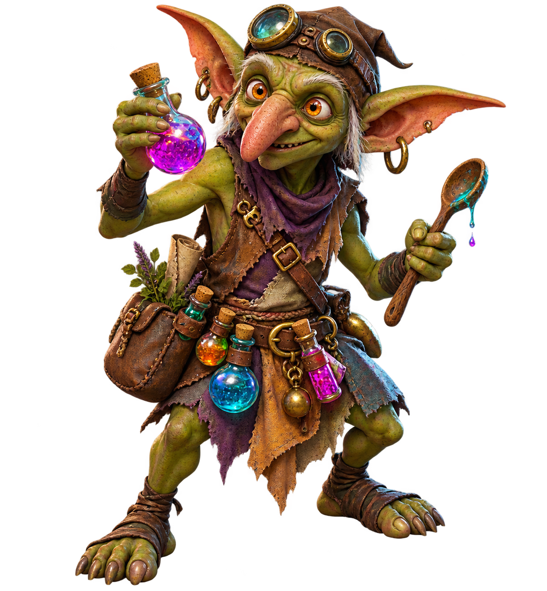
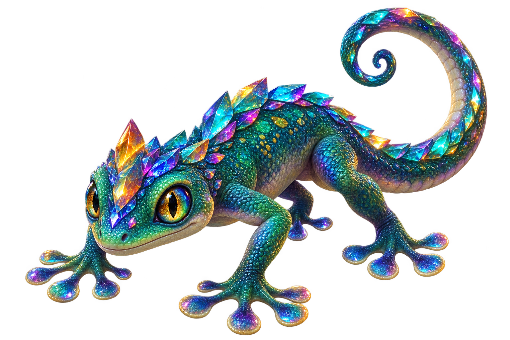
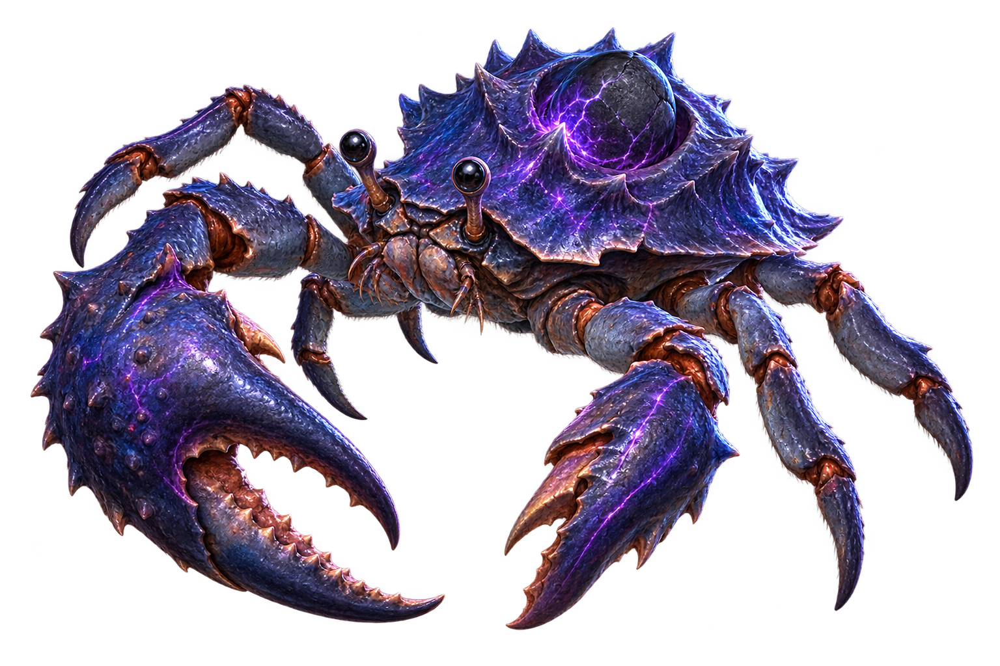
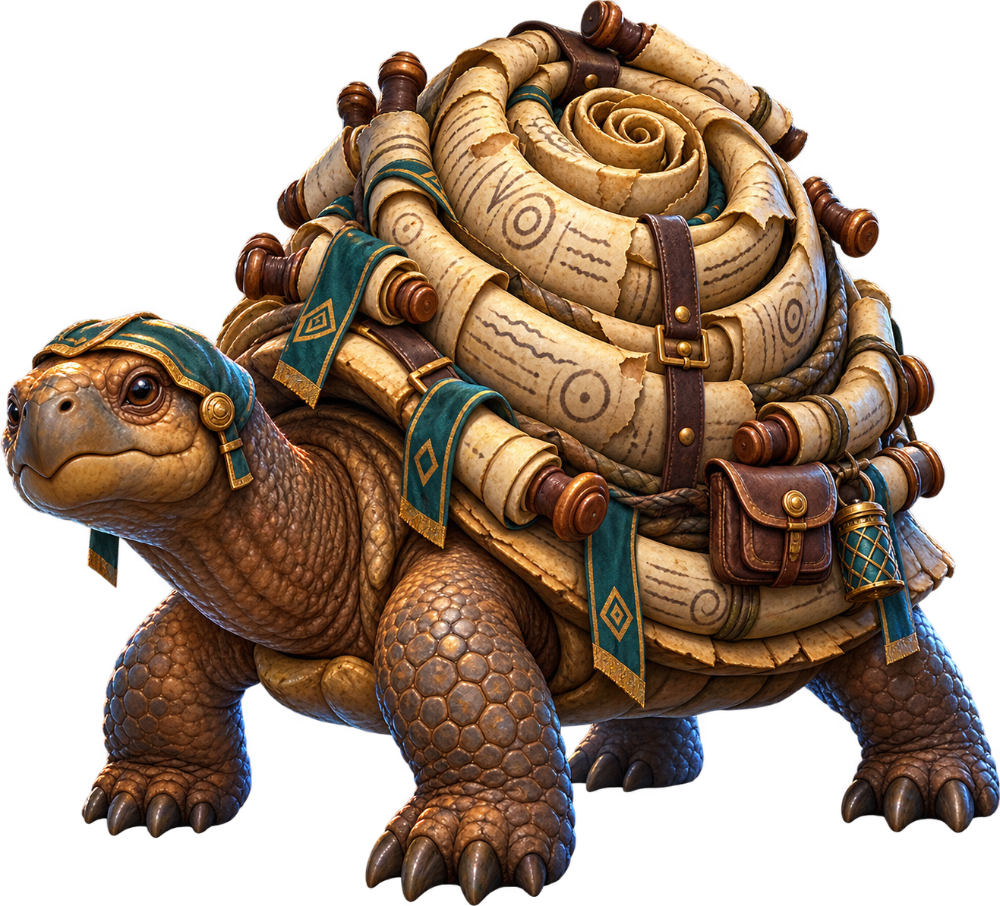
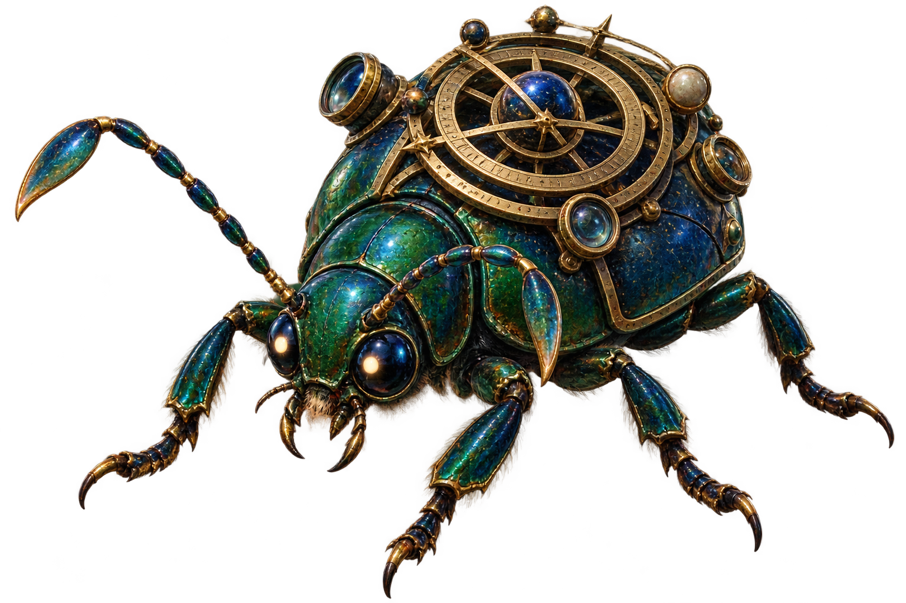
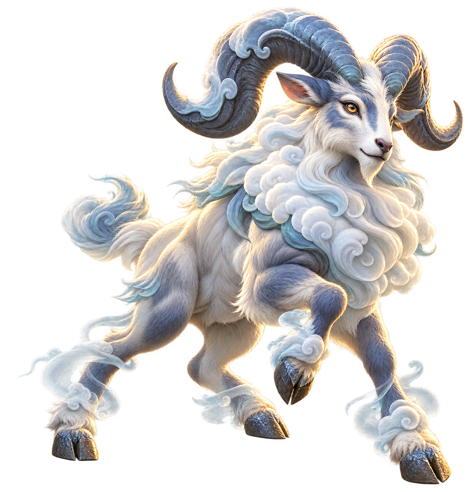
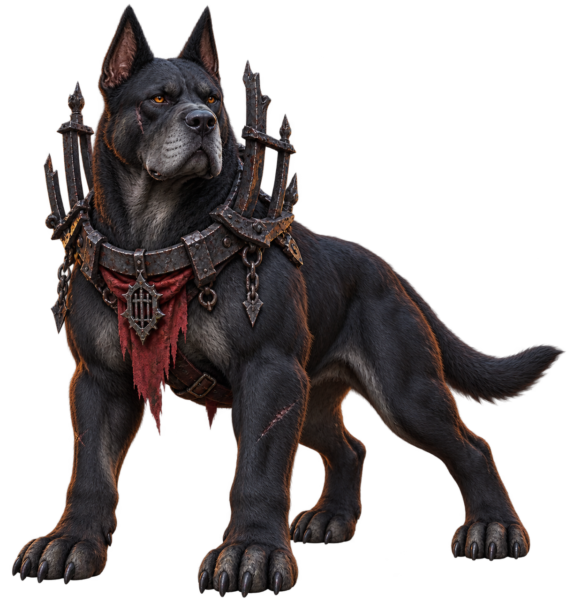
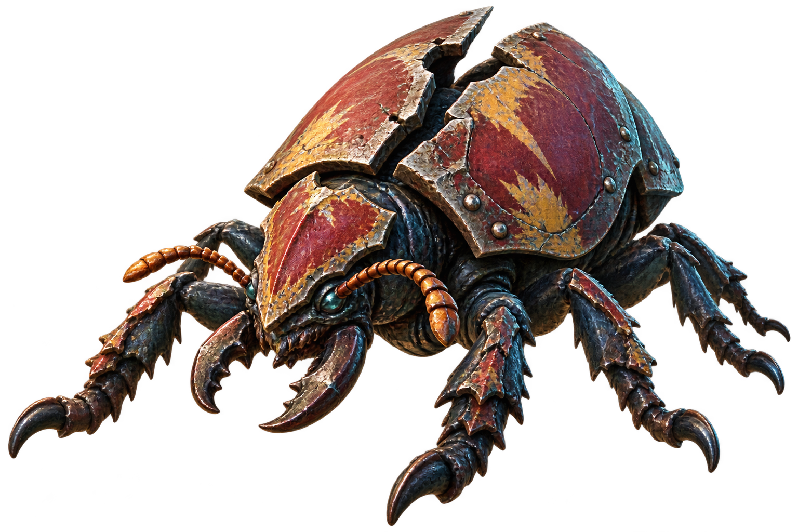
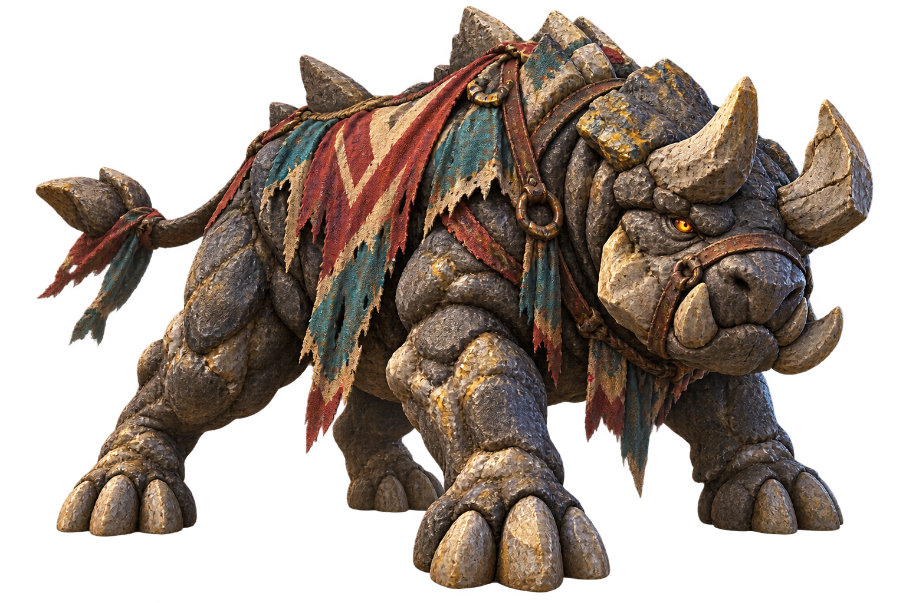
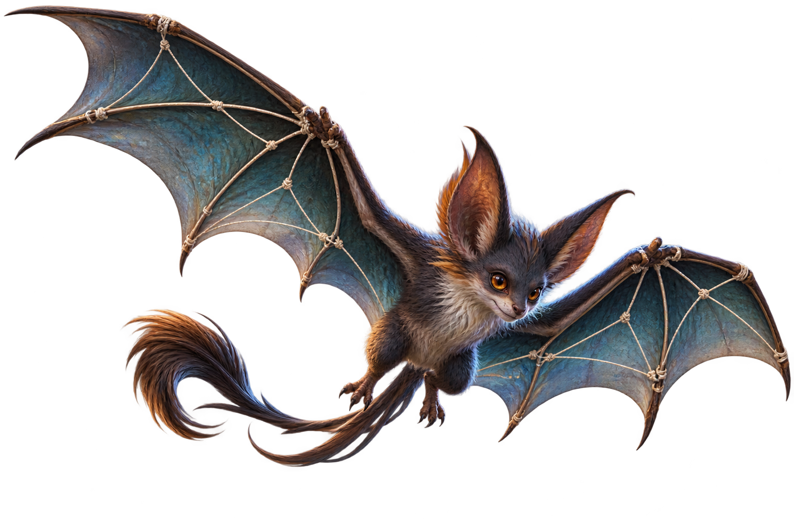

# ART003 B08 Owner Visual Review Pack

Task: `ART003_B08_M078_M088_CANONICAL_MONSTER_ART_PRODUCTION_001` 
Batch: `ART003_B08` 
Production base: `786b9f2335b42f777c03a0c6e604d4784dc7ec5b` 
Current origin/master: `81ab0f263bf72614c303199707e5e42d3ae559a4` 
Current origin/master tree: `28c81698dd883720da79517084d0781a8b551e15` 
F035 planning head: `195f3376e107559817e054476b076e471c211731` 
F035 assignment SHA-256: `49e704f0c9935056c5614e91feff28d4775c6f98d4b38f1b068639f7d72d5e00` 
F036 batch-plan head: `36eec98e972e5ed5e40acda83795ac1569e6eb1e` 
F035 zone distribution: `Z2=1, Z7=6, Z8=3`

This pack contains exactly ten B08 production candidates in exact ID order.
`M084` is intentionally excluded. The candidates are technical-pass art
assets only: they are not Owner-approved, runtime-mapped, gameplay-authoritative,
merged, or deployed.

Owner visual review status: **PENDING** (`0/10`) 
Owner decision per candidate: `PASS`, `REVISE`, or `REJECT` 
Review-pack bytes equal final candidate assets: **YES**

## Review matrix

| # | ID | Canonical name | Zone | Identity intent | Final asset | SHA-256 | Technical QA | Owner review |
|---:|---|---|---|---|---|---|---|---|
| 1 | M078 | Potion Gob | Z7 | Compact alchemy goblin with potion belt, glass vials, long ears and nose, and spoon. | `art/monsters/M078_potion_gob.png` | `1DF9FD02FF8935035F09C2DE091B3BA275622F28515CA8DBEB53A99DA9CD2ABE` | PASS | PENDING |
| 2 | M079 | Prism Gecko | Z7 | Low four-footed gecko with faceted prism scales, broad toe pads, and curling tail. | `art/monsters/M079_prism_gecko.png` | `0FCA459B3F511F846A67EF6D67D2A14699169C27B3BD34F0C52127B37E6505B0` | PASS | PENDING |
| 3 | M080 | Gravity Crab | Z7 | Broad low crab with oversized pincers, eye stalks, and a gravity stone set into its shell. | `art/monsters/M080_gravity_crab.png` | `1EB3748FB5DEF14D2FC7D48E95126176453A45AE62BAC7D74C631C704FD432EC` | PASS | PENDING |
| 4 | M081 | Scrollback Turtle | Z7 | Stout tortoise with a tall layered parchment-scroll shell, rods, cloth, and satchel. | `art/monsters/M081_scrollback_turtle.png` | `77338CB53EC6426A2137FA4DBFD65BAED90FAB84C19122AF9CCA99B39FC7D15C` | PASS | PENDING |
| 5 | M082 | Astrolabe Beetle | Z7 | Dark emerald beetle with a brass astrolabe disk mounted on its back and six legs. | `art/monsters/M082_astrolabe_beetle.png` | `E0C423770A86FD3054A747DD4FFD03187B7D26327BAA28C7AD6051287C1C58B4` | PASS | PENDING |
| 6 | M083 | Cloudstep Ram | Z7 | Agile horned ram with cloud-white wool, swept horns, hooves, and cloud wisps. | `art/monsters/M083_cloudstep_ram.png` | `595B29E90C127CFDE01D92359AF3FE1CF284343E8719BFF4D6496D8CCEDC415C` | PASS | PENDING |
| 7 | M085 | Blackgate Hound | Z8 | Muscular black hound with a broken iron gate collar and shoulder frame. | `art/monsters/M085_blackgate_hound.png` | `A4D565CEB543D7C99460049DD0DD94CC9767F46EC108AF63C205948381490BE9` | PASS | PENDING |
| 8 | M086 | Breakshield Beetle | Z8 | Low armored siege beetle with large mandibles and fractured shield shell plates. | `art/monsters/M086_breakshield_beetle.png` | `66E7C42844D98969DC966F878BCC429B5E05D2D62E013F11261A8ECE5B3F1491` | PASS | PENDING |
| 9 | M087 | Bannerbreak Stonebeast | Z8 | Stocky stone quadruped with tusks, horns, and a torn banner harness. | `art/monsters/M087_bannerbreak_stonebeast.png` | `77B87471DD39D108D6587FD75934FBAD5B3C0F735A6AC131B515595B850EE444` | PASS | PENDING |
| 10 | M088 | Stringwing Bat | Z2 | Nimble scout bat with long angular wings, visible string-like tendons, and tail tuft. | `art/monsters/M088_stringwing_bat.png` | `46F31E88FEDE01967BA060DC28AAD3BABD01EFCA08F8C6C1F79C7DFEDCD75C99` | PASS | PENDING |

## Visual candidates — exact review order

### 1. M078 — Potion Gob

Identity intent: compact wiry alchemy goblin with long ears and nose,
colorful potion belt, glass vials, and an alchemist spoon. 
Zone: `Z7` 
Final asset: `art/monsters/M078_potion_gob.png` 
SHA-256: `1DF9FD02FF8935035F09C2DE091B3BA275622F28515CA8DBEB53A99DA9CD2ABE` 
Owner review: **PENDING**

### 2. M079 — Prism Gecko

Identity intent: low four-footed gecko with faceted prism-scale ridge, broad
toe pads, and a long curling tail. 
Zone: `Z7` 
Final asset: `art/monsters/M079_prism_gecko.png` 
SHA-256: `0FCA459B3F511F846A67EF6D67D2A14699169C27B3BD34F0C52127B37E6505B0` 
Owner review: **PENDING**

### 3. M080 — Gravity Crab

Identity intent: broad low crab with two oversized pincers, multiple legs,
eye stalks, and a circular gravity stone on its shell. 
Zone: `Z7` 
Final asset: `art/monsters/M080_gravity_crab.png` 
SHA-256: `1EB3748FB5DEF14D2FC7D48E95126176453A45AE62BAC7D74C631C704FD432EC` 
Owner review: **PENDING**

### 4. M081 — Scrollback Turtle

Identity intent: stout tortoise with a tall layered parchment-scroll shell,
wooden rods, teal cloth, and a leather satchel. 
Zone: `Z7` 
Final asset: `art/monsters/M081_scrollback_turtle.png` 
SHA-256: `77338CB53EC6426A2137FA4DBFD65BAED90FAB84C19122AF9CCA99B39FC7D15C` 
Owner review: **PENDING**

### 5. M082 — Astrolabe Beetle

Identity intent: dark emerald beetle with a brass astrolabe disk on its back,
antennae, and a clearly insectoid six-legged body. 
Zone: `Z7` 
Final asset: `art/monsters/M082_astrolabe_beetle.png` 
SHA-256: `E0C423770A86FD3054A747DD4FFD03187B7D26327BAA28C7AD6051287C1C58B4` 
Owner review: **PENDING**

### 6. M083 — Cloudstep Ram

Identity intent: agile cloud-maned ram with huge swept gray horns, four hooves,
and small cloud wisps at the feet. 
Zone: `Z7` 
Final asset: `art/monsters/M083_cloudstep_ram.png` 
SHA-256: `595B29E90C127CFDE01D92359AF3FE1CF284343E8719BFF4D6496D8CCEDC415C` 
Owner review: **PENDING**

### 7. M085 — Blackgate Hound

Identity intent: muscular black hound with a broken iron gate-like collar and
shoulder frame, red cloth accent, and four clear paws. 
Zone: `Z8` 
Final asset: `art/monsters/M085_blackgate_hound.png` 
SHA-256: `A4D565CEB543D7C99460049DD0DD94CC9767F46EC108AF63C205948381490BE9` 
Owner review: **PENDING**

### 8. M086 — Breakshield Beetle

Identity intent: low six-legged siege beetle with large mandibles and broken
red-and-ochre shield-like shell plates. 
Zone: `Z8` 
Final asset: `art/monsters/M086_breakshield_beetle.png` 
SHA-256: `66E7C42844D98969DC966F878BCC429B5E05D2D62E013F11261A8ECE5B3F1491` 
Owner review: **PENDING**

### 9. M087 — Bannerbreak Stonebeast

Identity intent: stocky gray stone quadruped with tusks and horns, a torn
red-and-teal banner harness, and a heavy fortress-like body. 
Zone: `Z8` 
Final asset: `art/monsters/M087_bannerbreak_stonebeast.png` 
SHA-256: `77B87471DD39D108D6587FD75934FBAD5B3C0F735A6AC131B515595B850EE444` 
Owner review: **PENDING**

### 10. M088 — Stringwing Bat

Identity intent: nimble scout bat with long angular teal wings, visible cream
string-like tendons and knots, pointed ears, and tail tuft. 
Zone: `Z2` 
Final asset: `art/monsters/M088_stringwing_bat.png` 
SHA-256: `46F31E88FEDE01967BA060DC28AAD3BABD01EFCA08F8C6C1F79C7DFEDCD75C99` 
Owner review: **PENDING**

## Review boundary

`OWNER_VISUAL_REVIEW_STATUS=PENDING` and `OWNER_PASS_COUNT=0/10` are
intentional. Technical QA does not self-approve visual quality. Only explicit
Owner decisions may move an individual candidate to `PASS`, `REVISE`, or
`REJECT`; only Owner-PASS candidates may proceed to a separate B08-R1 freeze
and publication task.
