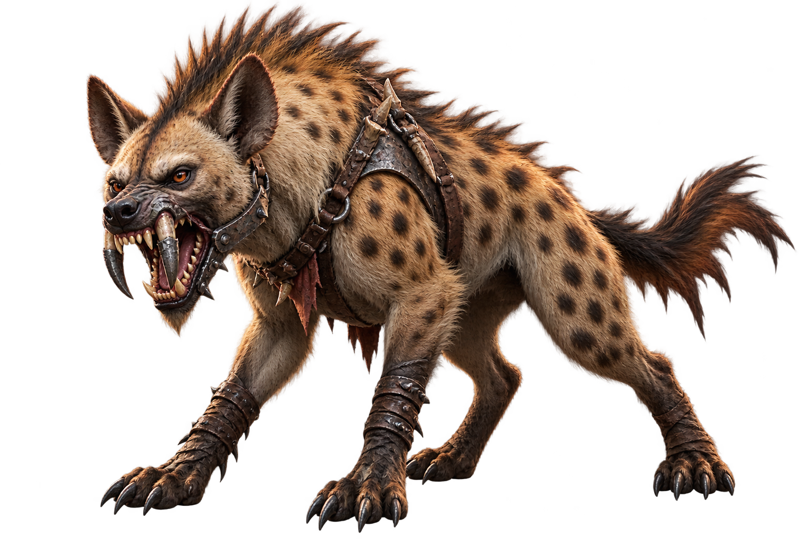
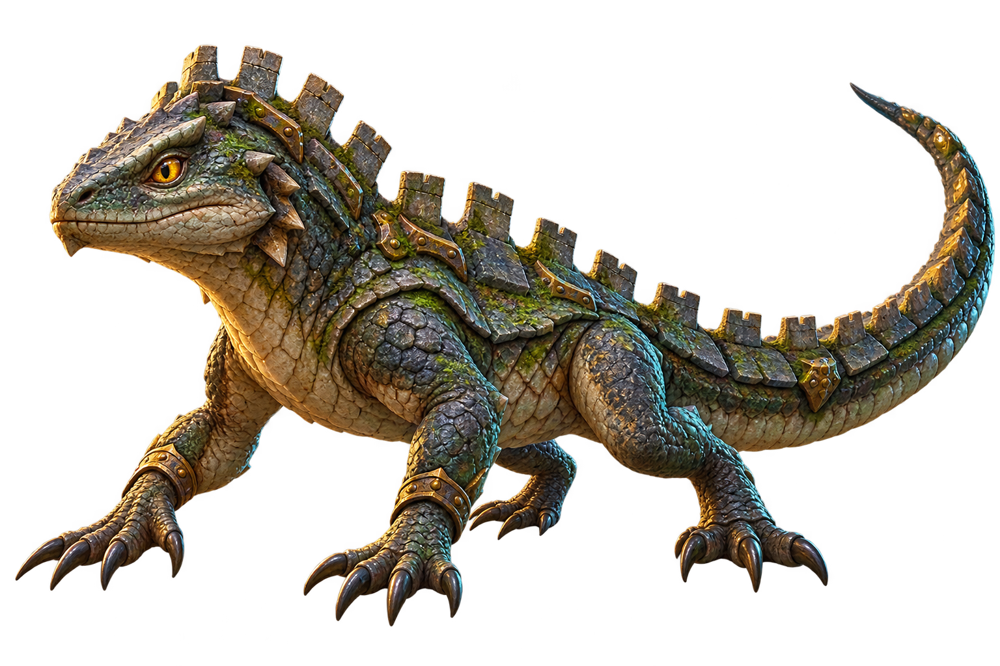
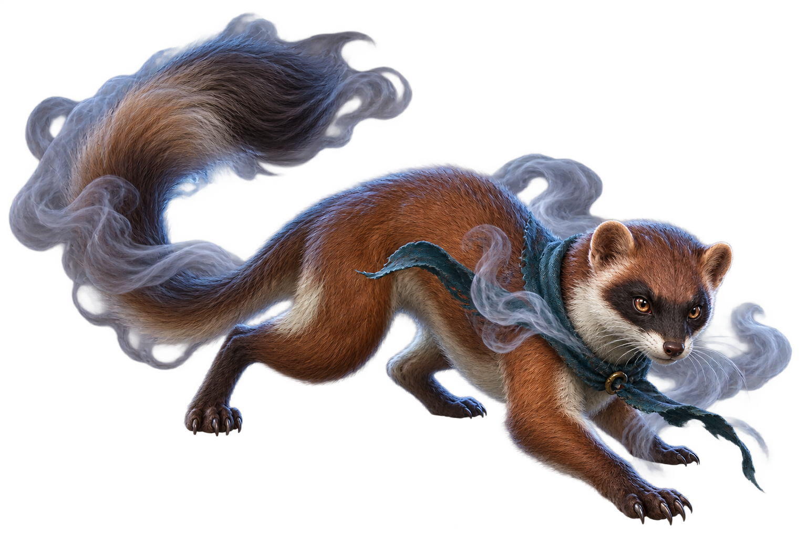
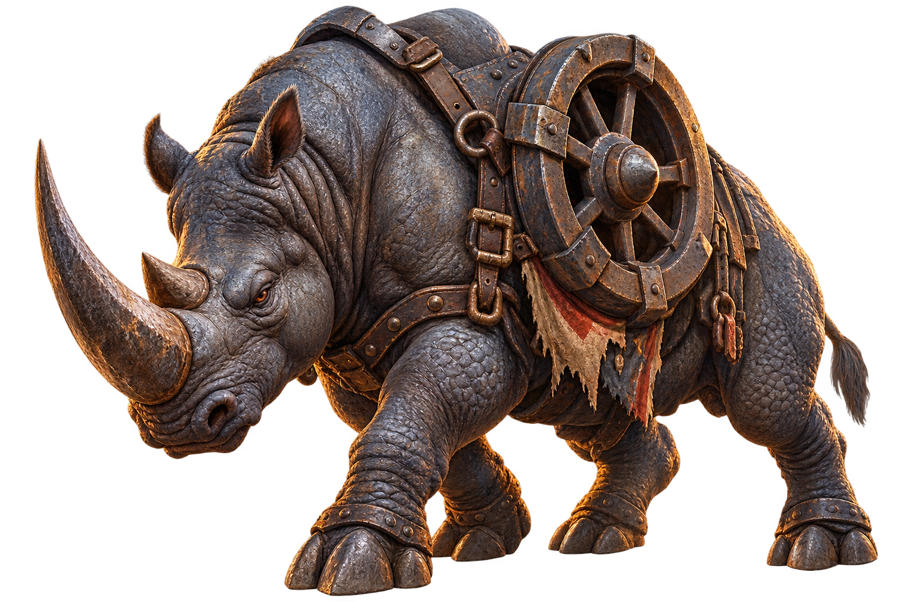
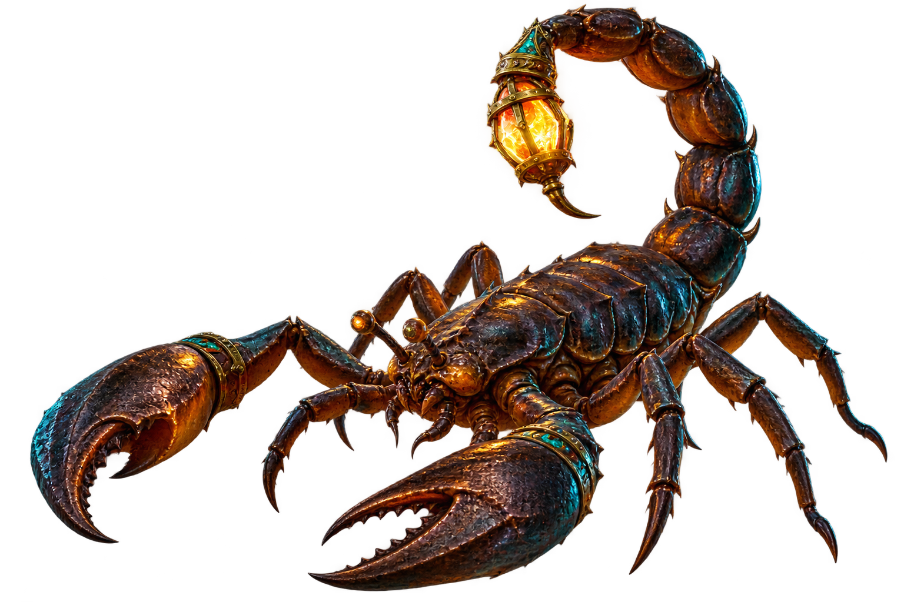
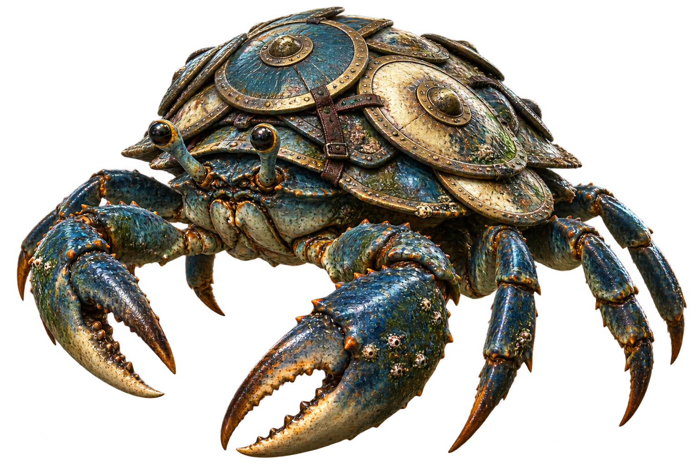
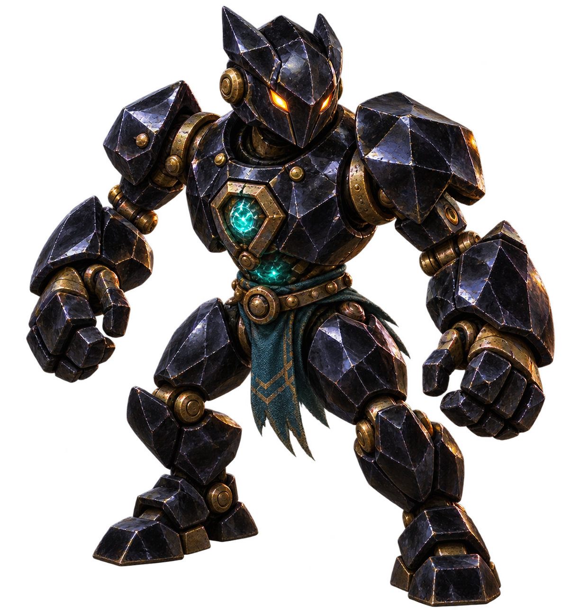
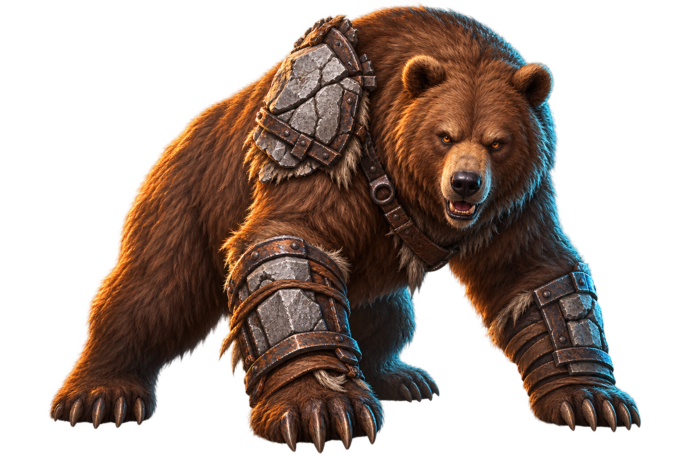
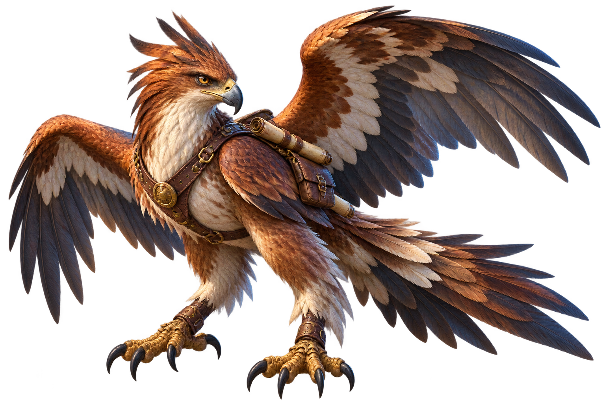
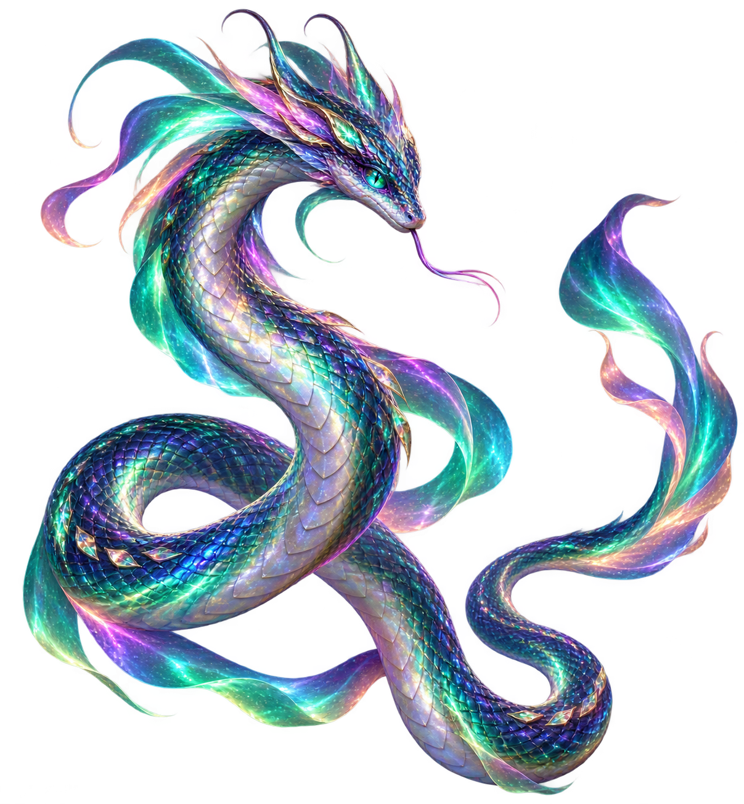

# ART003 B09 Owner Visual Review Pack

Task: `ART003_B09_M089_M099_CANONICAL_MONSTER_ART_PRODUCTION_001`
Batch: `ART003_B09`
Production branch: `codex/art003-b09-m089-m099-canonical-monster-art-production`
Production source head: `075d3174bf144ae48a9afa4dac6fba457794cfd5`
Production base / B08 canonical publication head: `af179e79407eb563ded840609fd3a7026fc6a09f`
Current origin/master: `81ab0f263bf72614c303199707e5e42d3ae559a4`
Current origin/master tree: `28c81698dd883720da79517084d0781a8b551e15`
F035 planning head: `195f3376e107559817e054476b076e471c211731`
F035 assignment SHA-256: `49e704f0c9935056c5614e91feff28d4775c6f98d4b38f1b068639f7d72d5e00`
F036 batch-plan head: `36eec98e972e5ed5e40acda83795ac1569e6eb1e`

This pack contains exactly ten B09 production candidates in the required
Owner-review order. `M098` is an existing protected legacy/runtime anchor and
is intentionally excluded. F035 zones are art-content planning metadata only;
these candidates are not gameplay-authoritative, runtime-mapped, merged, or
deployed.

Owner visual review status: **PENDING** (`0/10`)
Owner decision per candidate: `PASS`, `REVISE`, or `REJECT`
Review-pack bytes equal staged final assets: **YES**

## Review matrix

| # | ID | Canonical name | Zone | Identity intent | Final asset | SHA-256 | Technical QA | Owner review |
|---:|---|---|---|---|---|---|---|---|
| 1 | M089 | Steelfang Hyena | Z8 | Spotted frontier hyena with steel-capped fangs, iron jaw guard, and harness. | `art/monsters/M089_steelfang_hyena.png` | `ADD1C7F743CF80F1D6BD4CFD1EFEBE7263152243B7FE327D94A98255BEA2E12F` | PASS | PENDING |
| 2 | M090 | Battlement Lizard | Z8 | Low lizard with a crenellated masonry back ridge, sturdy legs, and long tail. | `art/monsters/M090_battlement_lizard.png` | `6ED5304B2A388D9E1382554E12CF6D0715171255647AFC0CC66C629BD1A658AE` | PASS | PENDING |
| 3 | M091 | Smokescreen Weasel | Z2 | Slender masked scout weasel with teal scarf, long tail, and smoke wisps. | `art/monsters/M091_smokescreen_weasel.png` | `0AFB9573B7C4134CA4A94E210991162CEB68225B5C946C76F52A06DC0C3C3C1A` | PASS | PENDING |
| 4 | M092 | Ironwheel Rhino | Z8 | Heavy rhino with a large horn and rusted iron wheel mounted in a flank harness. | `art/monsters/M092_ironwheel_rhino.png` | `704B057D9299237606A52E754DF22100AB553DA6672B145A282481B4DB193591` | PASS | PENDING |
| 5 | M093 | Beacon Scorpion | Z8 | Segmented scorpion with large pincers and a caged glowing beacon at its tail tip. | `art/monsters/M093_beacon_scorpion.png` | `415DD802D33407B8E551284F17F705CFD5358605E2BAA43DCD5D608E4F26ABF9` | PASS | PENDING |
| 6 | M094 | Shieldshell Crab | Z2 | Broad low crab with heavy pincers and overlapping round shield plates on its shell. | `art/monsters/M094_shieldshell_crab.png` | `75FCC20164AB7DAB93510EC235E078C9B021E9EB4E8200D2FB79FA0890EC291A` | PASS | PENDING |
| 7 | M095 | Obsidian Automaton | Z8 | Compact construct of faceted black obsidian armor, bronze joints, amber eyes, and teal core. | `art/monsters/M095_obsidian_automaton.png` | `205A804651D3316C595996A201B98270FFDA44CE6E2265930ABBB2FAF894E1A7` | PASS | PENDING |
| 8 | M096 | Wallbreak Bear | Z8 | Broad brown bear with stone-breaker bracers and cracked masonry shoulder plate. | `art/monsters/M096_wallbreak_bear.png` | `98A0AC843410749FAE756A4C0775A823B4351DB48593649B188F5D006CD1452A` | PASS | PENDING |
| 9 | M097 | Scout Hawkbeast | Z8 | Hawkbeast with hooked beak, layered wings, talons, fanned tail, and scout map tubes. | `art/monsters/M097_scout_hawkbeast.png` | `BF629CE24EE845DE1D947C172796F9BF927C5745A358E1CAC5D1E7ED00A08A61` | PASS | PENDING |
| 10 | M099 | Aurora Serpent | Z9 | Long coiled serpent with iridescent scales and flowing teal-violet-emerald aurora bands. | `art/monsters/M099_aurora_serpent.png` | `8FA97913D98207DA46C81BE60A0C0D5CF8AAFF1203BEA74D71BAD2FFE65E675F` | PASS | PENDING |

## Visual candidates — exact review order

### 1. M089 — Steelfang Hyena

Identity intent: lean spotted frontier hyena with a high mane, steel-capped
fangs, iron jaw guard, and worn leather harness straps.
Zone: `Z8`
Final asset: `art/monsters/M089_steelfang_hyena.png`
SHA-256: `ADD1C7F743CF80F1D6BD4CFD1EFEBE7263152243B7FE327D94A98255BEA2E12F`
Owner review: **PENDING**

### 2. M090 — Battlement Lizard

Identity intent: green slate lizard with four sturdy legs, long tail, and a
crenellated line of weathered masonry plates along its back.
Zone: `Z8`
Final asset: `art/monsters/M090_battlement_lizard.png`
SHA-256: `6ED5304B2A388D9E1382554E12CF6D0715171255647AFC0CC66C629BD1A658AE`
Owner review: **PENDING**

### 3. M091 — Smokescreen Weasel

Identity intent: slender russet weasel with dark facial mask, teal scout scarf,
long tail, and curling translucent smoke wisps.
Zone: `Z2`
Final asset: `art/monsters/M091_smokescreen_weasel.png`
SHA-256: `0AFB9573B7C4134CA4A94E210991162CEB68225B5C946C76F52A06DC0C3C3C1A`
Owner review: **PENDING**

### 4. M092 — Ironwheel Rhino

Identity intent: heavy gray rhino with a large horn, four thick legs, and a
prominent rusted iron wheel mounted in a flank harness.
Zone: `Z8`
Final asset: `art/monsters/M092_ironwheel_rhino.png`
SHA-256: `704B057D9299237606A52E754DF22100AB553DA6672B145A282481B4DB193591`
Owner review: **PENDING**

### 5. M093 — Beacon Scorpion

Identity intent: dark segmented scorpion with two large pincers, an arched
tail, and a caged glowing beacon at the stinger tip.
Zone: `Z8`
Final asset: `art/monsters/M093_beacon_scorpion.png`
SHA-256: `415DD802D33407B8E551284F17F705CFD5358605E2BAA43DCD5D608E4F26ABF9`
Owner review: **PENDING**

### 6. M094 — Shieldshell Crab

Identity intent: broad low blue-green crab with many legs, heavy pincers, and
overlapping round shield plates strapped across its shell.
Zone: `Z2`
Final asset: `art/monsters/M094_shieldshell_crab.png`
SHA-256: `75FCC20164AB7DAB93510EC235E078C9B021E9EB4E8200D2FB79FA0890EC291A`
Owner review: **PENDING**

### 7. M095 — Obsidian Automaton

Identity intent: compact four-limbed construct of faceted black obsidian armor,
bronze joints, amber eyes, and a teal chest core.
Zone: `Z8`
Final asset: `art/monsters/M095_obsidian_automaton.png`
SHA-256: `205A804651D3316C595996A201B98270FFDA44CE6E2265930ABBB2FAF894E1A7`
Owner review: **PENDING**

### 8. M096 — Wallbreak Bear

Identity intent: massive brown bear with stone-breaker bracers, cracked
masonry shoulder plate, broad paws, and an ordinary monster presentation.
Zone: `Z8`
Final asset: `art/monsters/M096_wallbreak_bear.png`
SHA-256: `98A0AC843410749FAE756A4C0775A823B4351DB48593649B188F5D006CD1452A`
Owner review: **PENDING**

### 9. M097 — Scout Hawkbeast

Identity intent: full-bodied hawkbeast with hooked beak, alert crest, broad
layered wings, powerful talons, fanned tail, and small scout map tubes.
Zone: `Z8`
Final asset: `art/monsters/M097_scout_hawkbeast.png`
SHA-256: `BF629CE24EE845DE1D947C172796F9BF927C5745A358E1CAC5D1E7ED00A08A61`
Owner review: **PENDING**

### 10. M099 — Aurora Serpent

Identity intent: long slender serpent in an S-curve coil with iridescent
scales, teal-violet-emerald aurora bands, bright eyes, and a tapered tail.
Zone: `Z9`
Final asset: `art/monsters/M099_aurora_serpent.png`
SHA-256: `8FA97913D98207DA46C81BE60A0C0D5CF8AAFF1203BEA74D71BAD2FFE65E675F`
Owner review: **PENDING**

## Owner decision boundary

Codex technical QA does not equal Owner visual approval. The Owner must review
all ten images and assign `PASS`, `REVISE`, or `REJECT` to each exact ID.
Only explicit Owner decisions may authorize a later B09-R1 freeze/publication
task. Do not self-approve, freeze, or publish these candidates as canonical
Owner-approved art.
