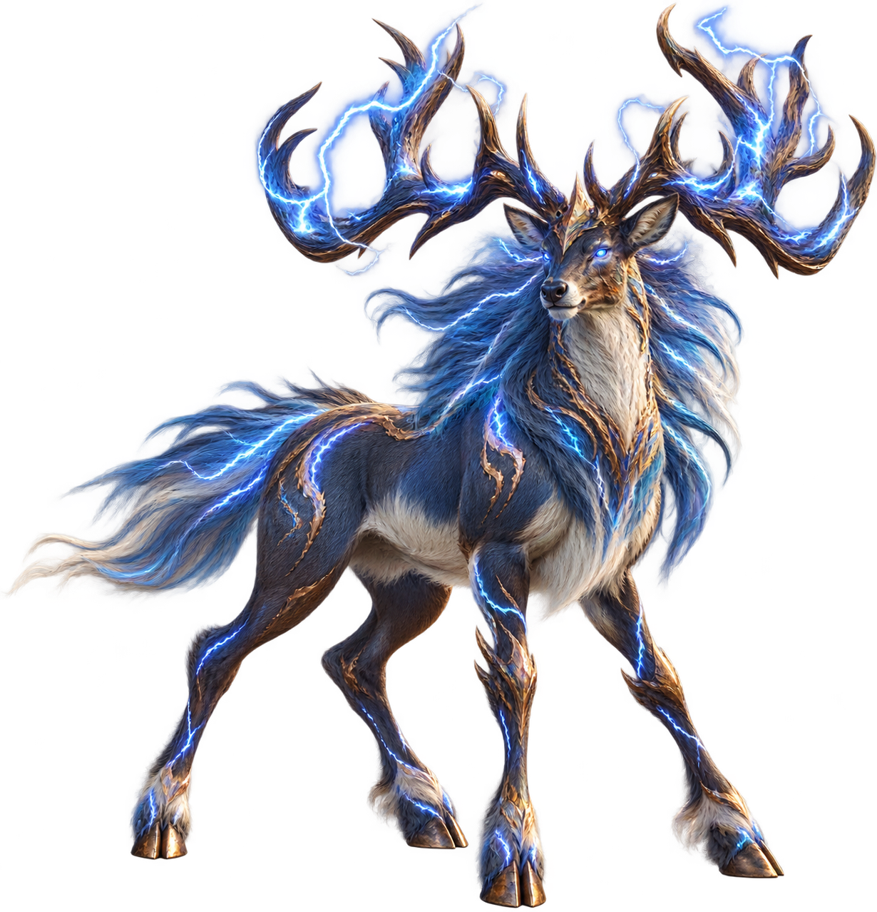
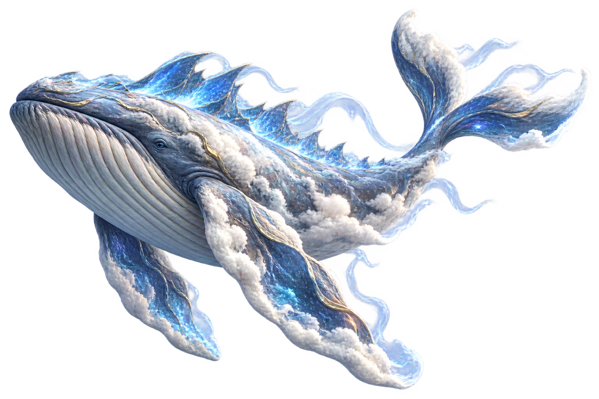
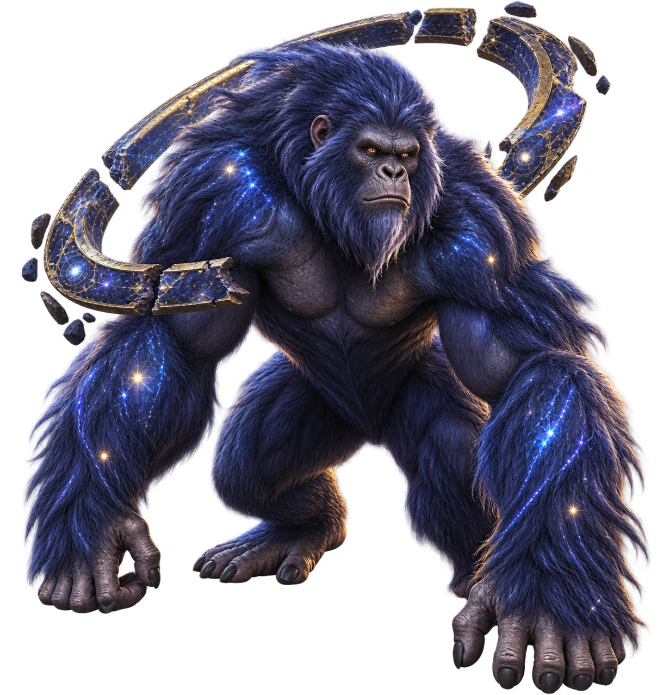
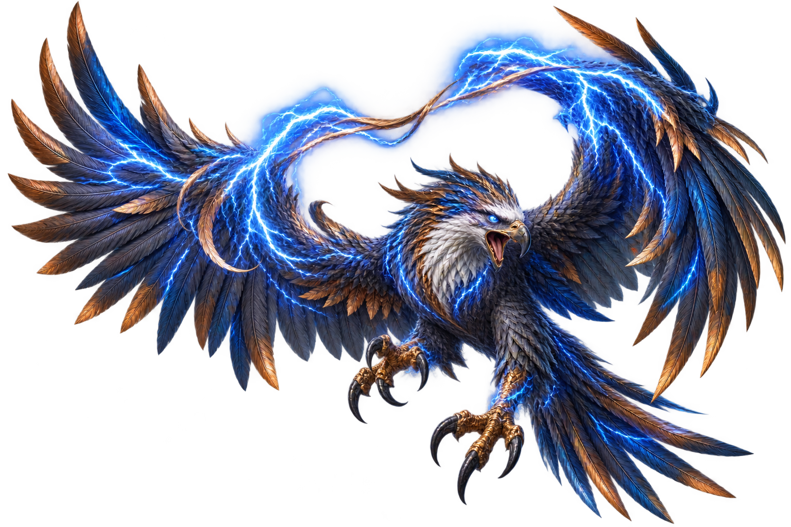
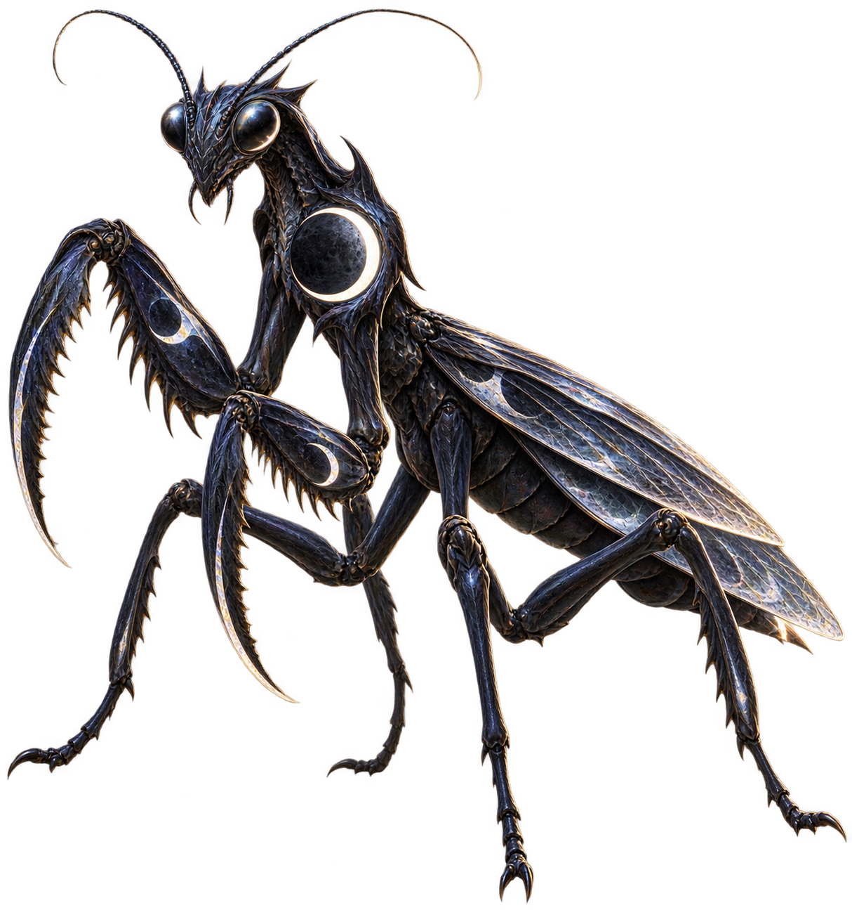
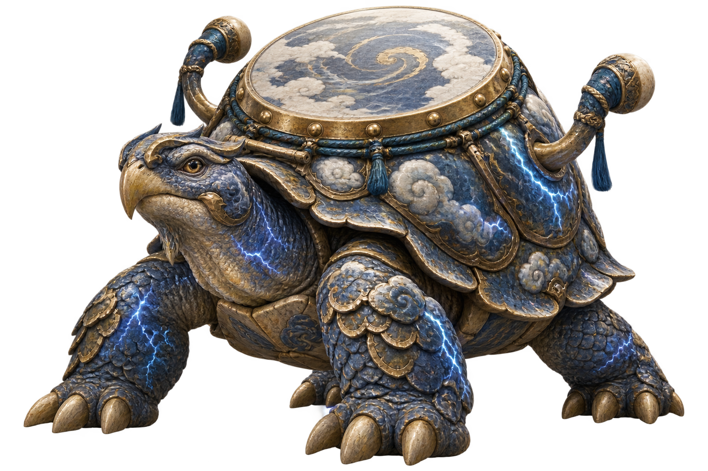
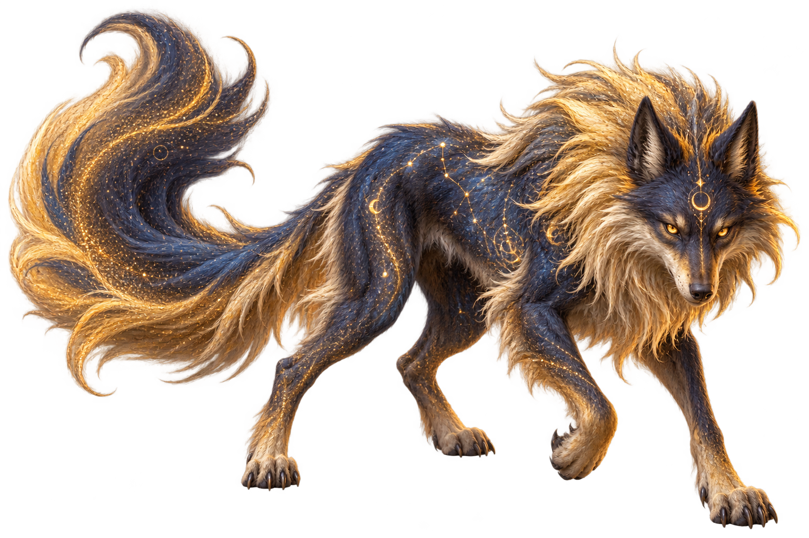
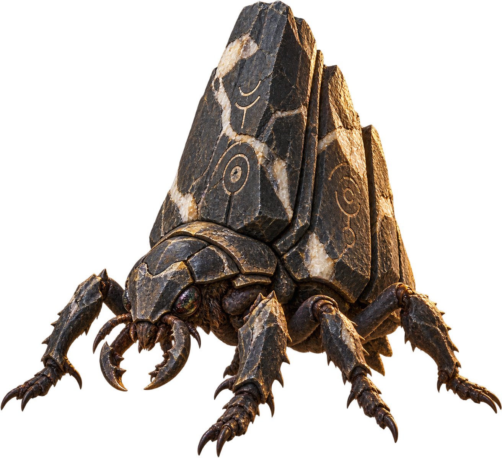
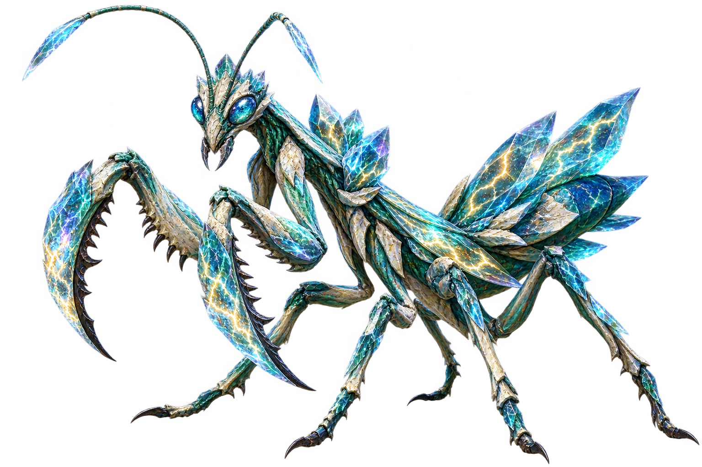
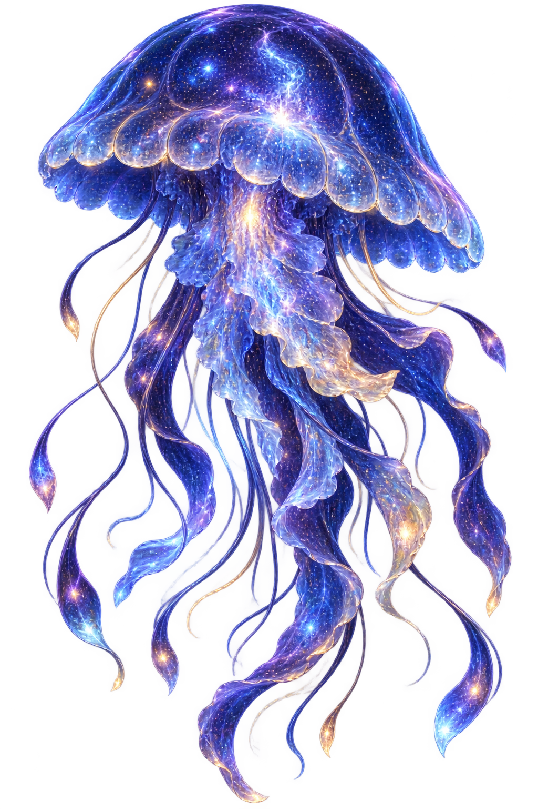

# ART003 B10 Owner Visual Review Pack

Task: `ART003_B10_M100_M109_CANONICAL_MONSTER_ART_PRODUCTION_001`

Status: `OWNER_VISUAL_REVIEW_STATUS=PENDING`

Owner pass count: `0/10`

This pack contains exactly the ten B10 candidates in F036 order. The images are
technical production candidates only. Codex has not self-approved visual
quality, and no candidate is runtime-mapped or gameplay-authoritative.

## Review order and matrix

| Order | ID | Canonical name | Planning zone | Identity intent | Final asset | SHA-256 | Review |
| ---: | --- | --- | --- | --- | --- | --- | --- |
| 1 | M100 | Thundercrown Stag | Z1 | Storm grazer with crown-like lightning antlers | `art/monsters/M100_thundercrown_stag.png` | `20C8E3CF6BF9E360111B2A80B358D9D3E5334B6DF808C12D40C7620F830B6ED5` | PENDING |
| 2 | M101 | Skyvault Whale | Z9 | Cloud whale with broad fins and sky-vault ridge | `art/monsters/M101_skyvault_whale.png` | `0D0EBC962AA976FBB68475A1C79A9B14086CDAAE9A1DF8C23A78A1B08D0CEAF2` | PENDING |
| 3 | M102 | Star-ring Ape | Z9 | Orbit ape with a broken star-metal ring | `art/monsters/M102_star_ring_ape.png` | `B13CF95BBE49DE6EA5436A1A62340F277311506D1EED6623577B0CE82071C779` | PENDING |
| 4 | M103 | Riftbow Eagle | Z9 | Storm eagle with a split bow-shaped storm arc | `art/monsters/M103_riftbow_eagle.png` | `7ADCAC9321B63ACCF1CF5E239FFDBE1F600FE35811CC54C416AC7BB4C81A80F8` | PENDING |
| 5 | M104 | Moon-eclipse Mantis | Z9 | Eclipse mantis with scythe forearms and moon disk | `art/monsters/M104_moon_eclipse_mantis.png` | `6EBB69384E8B6B9CCB59E98908199A2BB0C45E252964FABD7847200DA8227EF3` | PENDING |
| 6 | M105 | Skydrum Tortoise | Z1 | Storm tortoise with a domed drum-like shell | `art/monsters/M105_skydrum_tortoise.png` | `088131B2A947259D7199255B023161BE1F854D26855BA7079AAD6966E5ED6732` | PENDING |
| 7 | M106 | Starsand Wolf | Z9 | Star wolf with constellation-marked sand-gold fur | `art/monsters/M106_starsand_wolf.png` | `356DF03C08FFF522FF707D8CAF0F17278BF8BA80CFB8479B746C0BE06834F963` | PENDING |
| 8 | M107 | Monolith Beetle | Z1 | Monument beetle with a towering basalt carapace | `art/monsters/M107_monolith_beetle.png` | `BF342DD63A3E7B01601385CCDB8DA760B62DB7E8AEF9AFEA625927634C9FBA10` | PENDING |
| 9 | M108 | Thundercrystal Mantis | Z9 | Crystal mantis with faceted thunder crystals | `art/monsters/M108_thundercrystal_mantis.png` | `6B8D34B5039DF82B28FC57BEB4BDED7C47438B2263CD5EF30363EDFF89485DB0` | PENDING |
| 10 | M109 | Firmament Jelly | Z9 | Sky jelly with translucent bell and star-speckled tendrils | `art/monsters/M109_firmament_jelly.png` | `4DF9C8972C15BBB35E894A7AEF62DE6BA3400EA654F81257D09AA351113459E2` | PENDING |

## Candidate images

### 1. M100 — Thundercrown Stag

Zone: `Z1`  
Identity: storm grazer; antlered stag silhouette with a crown-like lightning
antler motif.  
Final asset: `art/monsters/M100_thundercrown_stag.png`  
SHA-256: `20C8E3CF6BF9E360111B2A80B358D9D3E5334B6DF808C12D40C7620F830B6ED5`  
Owner review: `PENDING`

### 2. M101 — Skyvault Whale

Zone: `Z9`  
Identity: cloud whale; broad fins, whale anatomy, and a sky-vault ridge.  
Final asset: `art/monsters/M101_skyvault_whale.png`  
SHA-256: `0D0EBC962AA976FBB68475A1C79A9B14086CDAAE9A1DF8C23A78A1B08D0CEAF2`  
Owner review: `PENDING`

### 3. M102 — Star-ring Ape

Zone: `Z9`  
Identity: orbit ape; stocky simian anatomy with a broken star-metal orbit ring.  
Final asset: `art/monsters/M102_star_ring_ape.png`  
SHA-256: `B13CF95BBE49DE6EA5436A1A62340F277311506D1EED6623577B0CE82071C779`  
Owner review: `PENDING`

### 4. M103 — Riftbow Eagle

Zone: `Z9`  
Identity: storm eagle; sharp beak, feathered wings, talons, and split storm arc.  
Final asset: `art/monsters/M103_riftbow_eagle.png`  
SHA-256: `7ADCAC9321B63ACCF1CF5E239FFDBE1F600FE35811CC54C416AC7BB4C81A80F8`  
Owner review: `PENDING`

### 5. M104 — Moon-eclipse Mantis

Zone: `Z9`  
Identity: eclipse mantis; six insect legs, scythe forearms, and a moon disk.  
Final asset: `art/monsters/M104_moon_eclipse_mantis.png`  
SHA-256: `6EBB69384E8B6B9CCB59E98908199A2BB0C45E252964FABD7847200DA8227EF3`  
Owner review: `PENDING`

### 6. M105 — Skydrum Tortoise

Zone: `Z1`  
Identity: storm tortoise; stout tortoise anatomy and a domed drum-like shell.  
Final asset: `art/monsters/M105_skydrum_tortoise.png`  
SHA-256: `088131B2A947259D7199255B023161BE1F854D26855BA7079AAD6966E5ED6732`  
Owner review: `PENDING`

### 7. M106 — Starsand Wolf

Zone: `Z9`  
Identity: star wolf; lean canine body, sand-gold mane, bushy tail, and constellations.  
Final asset: `art/monsters/M106_starsand_wolf.png`  
SHA-256: `356DF03C08FFF522FF707D8CAF0F17278BF8BA80CFB8479B746C0BE06834F963`  
Owner review: `PENDING`

### 8. M107 — Monolith Beetle

Zone: `Z1`  
Identity: monument beetle; six-legged beetle with a towering basalt monolith carapace.  
Final asset: `art/monsters/M107_monolith_beetle.png`  
SHA-256: `BF342DD63A3E7B01601385CCDB8DA760B62DB7E8AEF9AFEA625927634C9FBA10`  
Owner review: `PENDING`

### 9. M108 — Thundercrystal Mantis

Zone: `Z9`  
Identity: crystal mantis; six-legged mantis with teal chitin, faceted crystals, and lightning veins.  
Final asset: `art/monsters/M108_thundercrystal_mantis.png`  
SHA-256: `6B8D34B5039DF82B28FC57BEB4BDED7C47438B2263CD5EF30363EDFF89485DB0`  
Owner review: `PENDING`

### 10. M109 — Firmament Jelly

Zone: `Z9`  
Identity: sky jelly; translucent bell, ribbon tendrils, and star-speckled cobalt body.  
Final asset: `art/monsters/M109_firmament_jelly.png`  
SHA-256: `4DF9C8972C15BBB35E894A7AEF62DE6BA3400EA654F81257D09AA351113459E2`  
Owner review: `PENDING`

## Owner decision gate

Please review all ten images in the exact order above and assign each one
`PASS`, `REVISE`, or `REJECT`. This production task remains pending until the
Owner decision is explicit. Only Owner-PASS candidates may proceed to the
separate B10-R1 freeze/publication task.

No M084 candidate is included. No B10 image is runtime-mapped, gameplay
authoritative, or deployed by this task.
