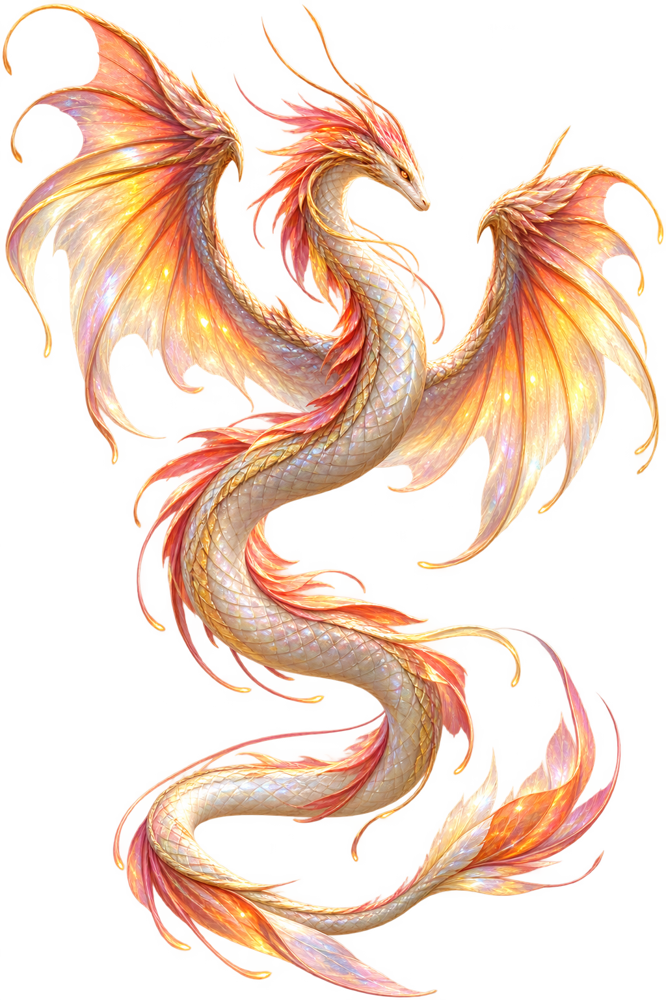
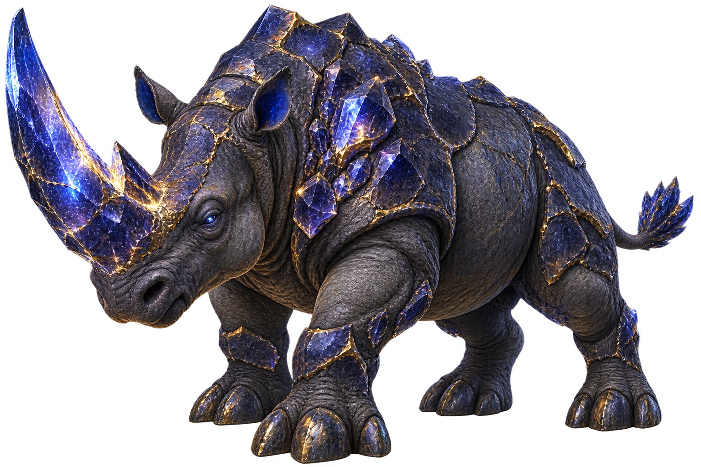
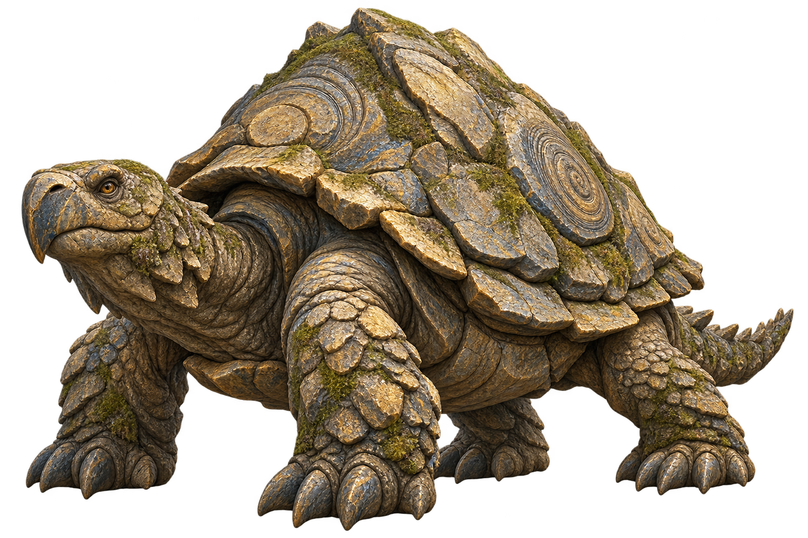
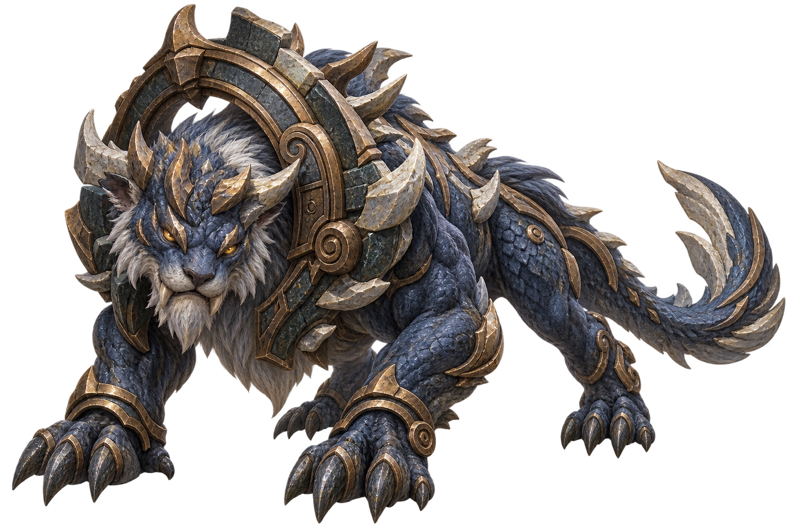
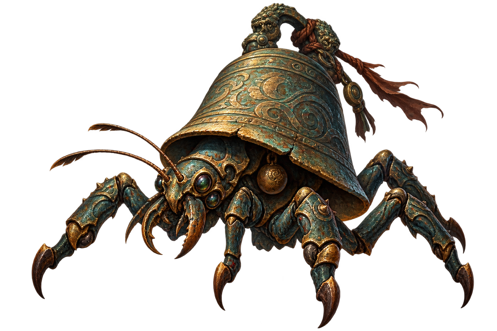
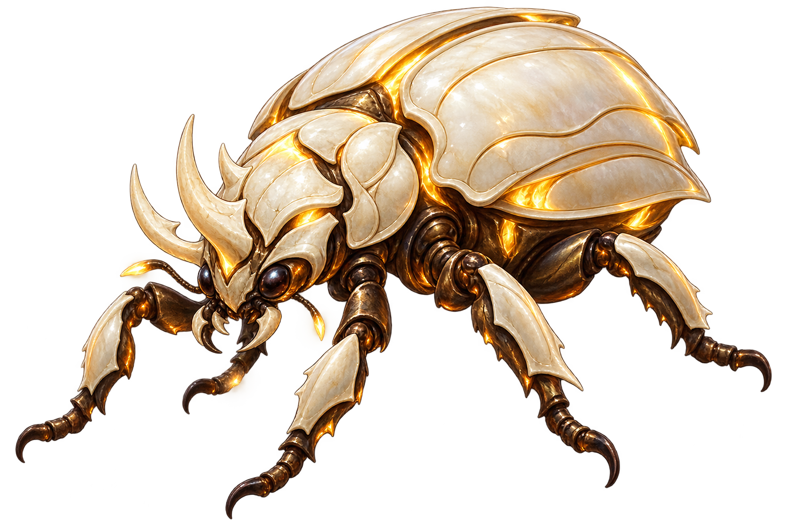
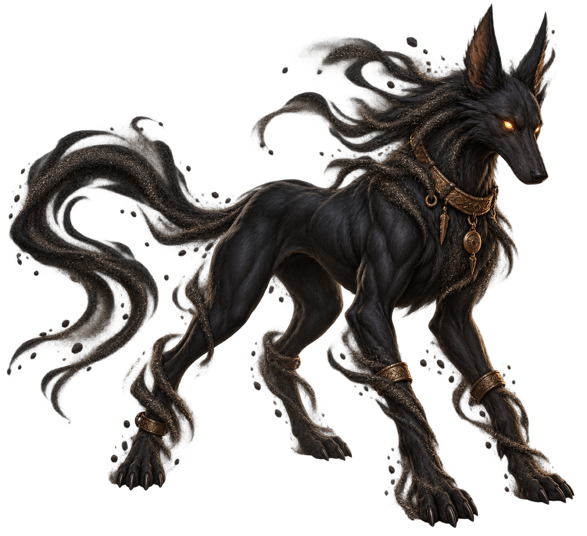
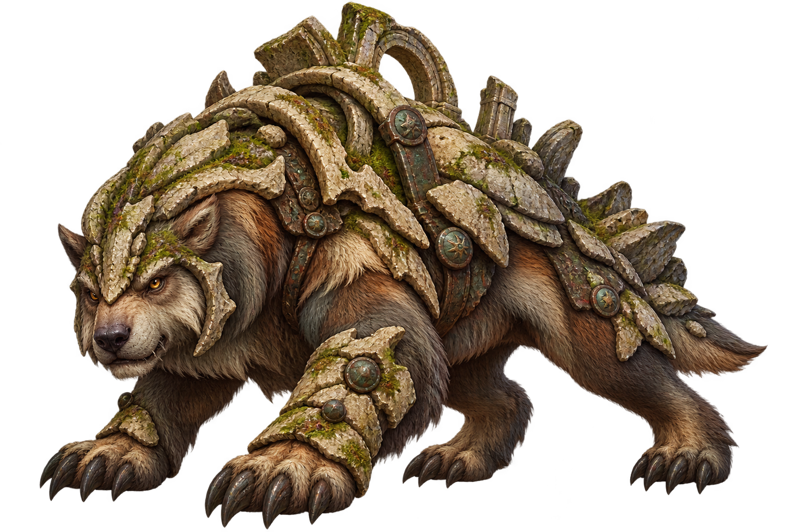
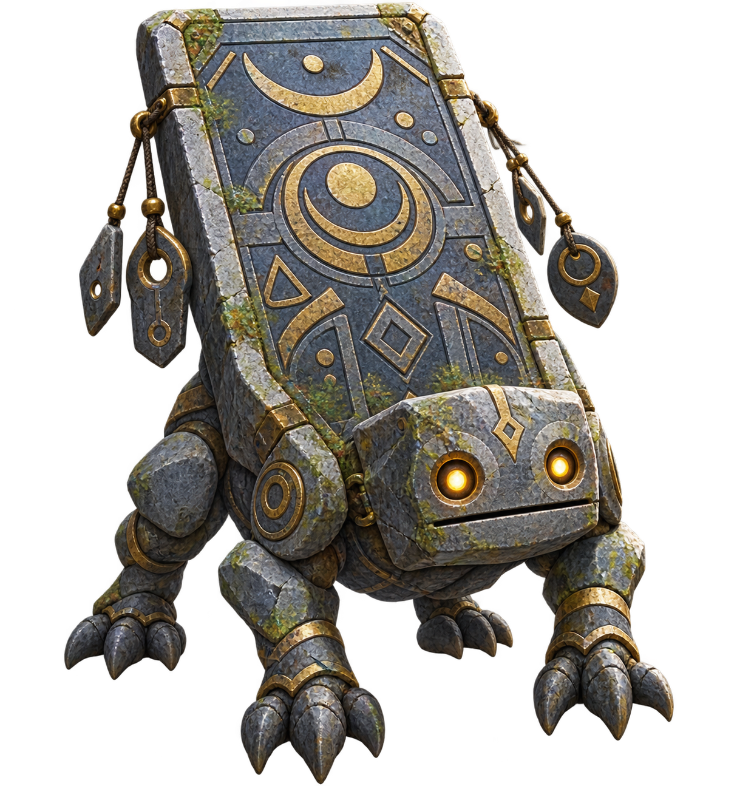
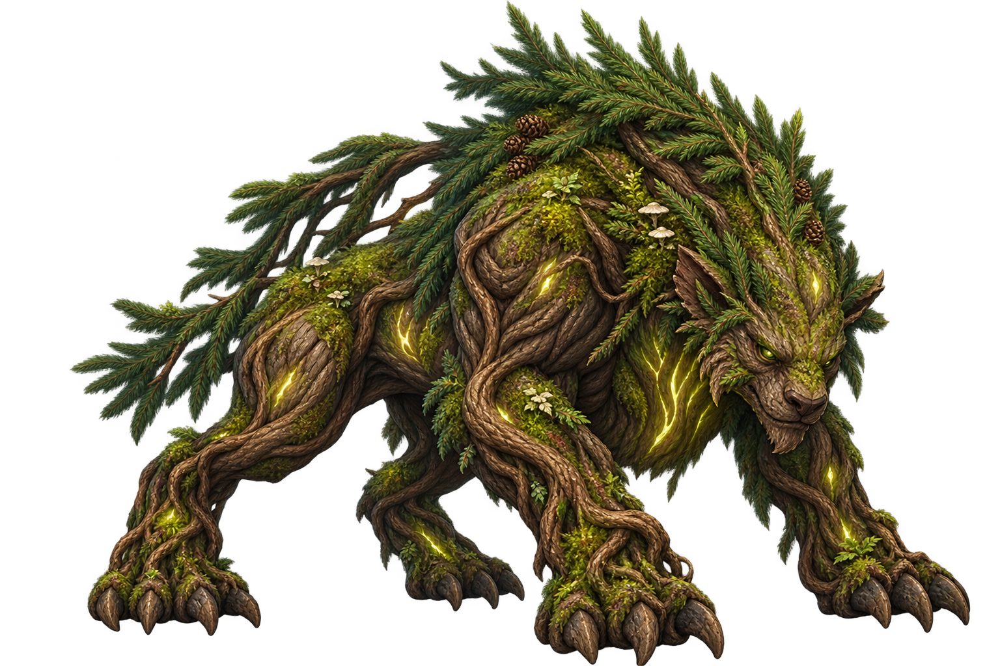

# ART003 B11 Owner Visual Review Pack

Task: `ART003_B11_FINAL_CANONICAL_MONSTER_ART_PRODUCTION_001`

`OWNER_VISUAL_REVIEW_STATUS=PENDING`

Owner pass count: `0/10`

This pack contains exactly the ten candidates from F036 B11 in authoritative
order. They are technical production candidates only. Owner visual review is
required; Codex has not self-approved any candidate. No candidate is runtime
mapped, gameplay-authoritative, or deployed.

Source branch: `codex/art003-b11-final-canonical-monster-art-production`

Asset-bearing source head: `SOURCE_HEAD_PENDING_FIRST_B11_ASSET_COMMIT`

## Review order and matrix

| Order | ID | Canonical name | Zone | Identity intent | Final asset | SHA-256 | Review |
| ---: | --- | --- | --- | --- | --- | --- | --- |
| 1 | M110 | Dawnwing Serpent | Z1 | Winged dawn serpent with a clear S-shaped body and sunrise-feather fins | `art/monsters/M110_dawnwing_serpent.png` | `8CE6A97421B1FEC08843D439C0BCBC70C70708DDBF246FDAD6B783DB0D8DAED7` | PENDING |
| 2 | M111 | Starshard Rhino | Z9 | Heavy rhino with one faceted starshard horn and indigo crystal armor | `art/monsters/M111_starshard_rhino.png` | `8797C8B3C6C03F05E487FA6E32171FB9F9928054231617E557FA2C1090329469` | PENDING |
| 3 | M113 | Timeworn Stone Turtle | Z10 | Weathered stone turtle with chipped shell, erosion rings, and moss | `art/monsters/M113_timeworn_stone_turtle.png` | `C9DF5490326B94CD81F7AB959CDB36B7A702DC897F3036D0CF3C465C3241BA4F` | PENDING |
| 4 | M114 | Endgate Beast | Z10 | Heavy quadruped with an arched gate-shaped relic collar | `art/monsters/M114_endgate_beast.png` | `D5ED74E8B0107D103F7BC058E400D11FD88216D8C41FB32188BCF3A9EB8739A0` | PENDING |
| 5 | M115 | Ancient Bell Crawler | Z10 | Six-legged relic crawler carrying one large ancient bell | `art/monsters/M115_ancient_bell_crawler.png` | `C60476E4D531E4901F589955ED2479AB7655CEFFE901123D49127A6118085D0B` | PENDING |
| 6 | M116 | Ivorylight Beetle | Z10 | Compact ivory scarab with warm light glowing through its shell | `art/monsters/M116_ivorylight_beetle.png` | `5D2FEAEC1E8E7F1C31384D58476F35C72809B62C3C221AF0398DB1D203802245` | PENDING |
| 7 | M117 | Blacksand Hound | Z10 | Lean black hound with black-sand ribbons around mane, legs, and tail | `art/monsters/M117_blacksand_hound.png` | `6F64B3152D4E45216C07D7B98946BBD8E68B432FFAD800065CC0401C78F5D50D` | PENDING |
| 8 | M118 | Relic Shellbeast | Z10 | Broad quadruped with a massive fossil-relic shell harness | `art/monsters/M118_relic_shellbeast.png` | `F159A42E67BE06664B61DD96F2C690935003EE5E96A01360E9342CCA6BBB1DCF` | PENDING |
| 9 | M119 | Silent Tabletling | Z10 | Compact stone creature with a flat tablet torso and sealed mouth | `art/monsters/M119_silent_tabletling.png` | `D732AC3BFD501B33A829CF28B53E08A036DBB83781C0BEDAB5521F4E98A97B64` | PENDING |
| 10 | M120 | Evergreen Rootbeast | Z10 | Four-legged living-root beast with evergreen bough crown and sap glow | `art/monsters/M120_evergreen_rootbeast.png` | `D57B6A24AD2374EA5C6E899A9AD119F4D416709727E18A88A49B67B7B1592E85` | PENDING |

## Candidate images

### 1. M110 — Dawnwing Serpent

Zone: `Z1`
Identity: dawn serpent; winged serpentine silhouette with sunrise-feather fins and warm dawn membranes.
Final asset: `art/monsters/M110_dawnwing_serpent.png`
SHA-256: `8CE6A97421B1FEC08843D439C0BCBC70C70708DDBF246FDAD6B783DB0D8DAED7`
Owner review: `PENDING`

### 2. M111 — Starshard Rhino

Zone: `Z9`
Identity: star rhino; heavy rhino body, one faceted starshard horn, and indigo crystal armor.
Final asset: `art/monsters/M111_starshard_rhino.png`
SHA-256: `8797C8B3C6C03F05E487FA6E32171FB9F9928054231617E557FA2C1090329469`
Owner review: `PENDING`

### 3. M113 — Timeworn Stone Turtle

Zone: `Z10`
Identity: time tortoise; low sandstone turtle with chipped shell, erosion rings, and moss.
Final asset: `art/monsters/M113_timeworn_stone_turtle.png`
SHA-256: `C9DF5490326B94CD81F7AB959CDB36B7A702DC897F3036D0CF3C465C3241BA4F`
Owner review: `PENDING`

### 4. M114 — Endgate Beast

Zone: `Z10`
Identity: gate beast; heavy quadruped with a blunt muzzle and an arched gate-shaped relic collar.
Final asset: `art/monsters/M114_endgate_beast.png`
SHA-256: `D5ED74E8B0107D103F7BC058E400D11FD88216D8C41FB32188BCF3A9EB8739A0`
Owner review: `PENDING`

### 5. M115 — Ancient Bell Crawler

Zone: `Z10`
Identity: relic crawler; low six-legged body carrying one large bronze-and-stone bell with a visible clapper.
Final asset: `art/monsters/M115_ancient_bell_crawler.png`
SHA-256: `C60476E4D531E4901F589955ED2479AB7655CEFFE901123D49127A6118085D0B`
Owner review: `PENDING`

### 6. M116 — Ivorylight Beetle

Zone: `Z10`
Identity: ivory beetle; compact six-legged scarab with ivory plates and warm light in shell seams.
Final asset: `art/monsters/M116_ivorylight_beetle.png`
SHA-256: `5D2FEAEC1E8E7F1C31384D58476F35C72809B62C3C221AF0398DB1D203802245`
Owner review: `PENDING`

### 7. M117 — Blacksand Hound

Zone: `Z10`
Identity: relic hound; lean black canine with obsidian fur and streaming black-sand ribbons.
Final asset: `art/monsters/M117_blacksand_hound.png`
SHA-256: `6F64B3152D4E45216C07D7B98946BBD8E68B432FFAD800065CC0401C78F5D50D`
Owner review: `PENDING`

### 8. M118 — Relic Shellbeast

Zone: `Z10`
Identity: ruin beast; powerful broad-muzzled quadruped with a fossil-relic shell harness.
Final asset: `art/monsters/M118_relic_shellbeast.png`
SHA-256: `F159A42E67BE06664B61DD96F2C690935003EE5E96A01360E9342CCA6BBB1DCF`
Owner review: `PENDING`

### 9. M119 — Silent Tabletling

Zone: `Z10`
Identity: tablet construct; compact squat stone creature with a flat tablet torso and sealed quiet mouth.
Final asset: `art/monsters/M119_silent_tabletling.png`
SHA-256: `D732AC3BFD501B33A829CF28B53E08A036DBB83781C0BEDAB5521F4E98A97B64`
Owner review: `PENDING`

### 10. M120 — Evergreen Rootbeast

Zone: `Z10`
Identity: ancient root beast; squat four-legged living roots with evergreen boughs, moss, and sap glow.
Final asset: `art/monsters/M120_evergreen_rootbeast.png`
SHA-256: `D57B6A24AD2374EA5C6E899A9AD119F4D416709727E18A88A49B67B7B1592E85`
Owner review: `PENDING`

## Owner decision gate

Please review all ten images in the exact order above and assign each one
`PASS`, `REVISE`, or `REJECT`. This task remains pending until the Owner
decision is explicit. Do not begin B11-R1 or any later batch from this pack.

No M112 candidate is included. No B11 candidate is runtime-mapped,
gameplay-authoritative, or deployed by this task.
